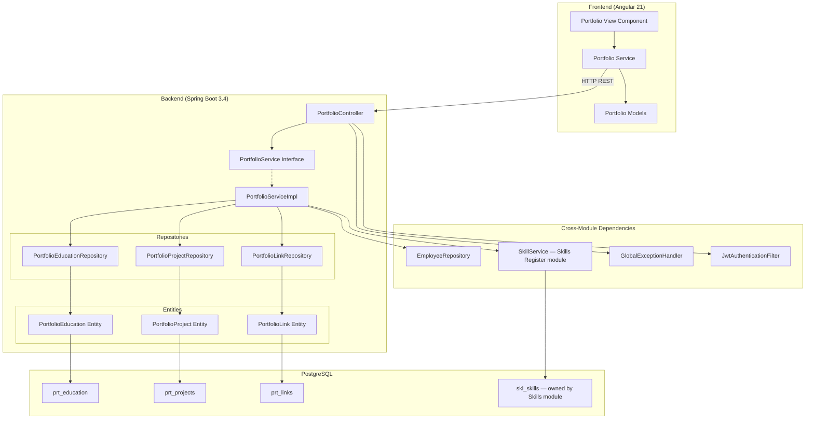
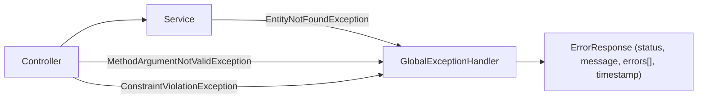

# Design Document: Employee Portfolio

## Overview

The Employee Portfolio feature replaces the current generic `PortfolioItem` model with dedicated entities (education, projects, links) and a read-only skills view sourced from the Skills Register module. The feature provides structured, per-employee portfolio management spanning the full stack: JPA entities with dedicated database tables (prefixed `prt_`), a service layer with CRUD operations for education/projects/links, integration with `SkillService` for read-only skills display, a REST controller exposing endpoints under `/api/portfolios`, and an Angular standalone component rendered at `/portfolio/:employeeId`.

**Skills Architecture Note:** The portfolio's Skills section is READ-ONLY and sourced from the Skills Register module (`skl_skills` table via `SkillService`). The `prt_skills` table is no longer used by the portfolio module. Skills CRUD (create, update, delete) happens via the `/api/skills` endpoints managed by the skills module.

This design follows the existing modular monolith patterns established by the `skills` module — public service interface, package-private internals, record-based DTOs, Jakarta Bean Validation at the controller layer, and constructor injection throughout.

## Architecture

### Component Diagram



### Key Architecture Decisions

1. **Skills sourced from Skills Register module (read-only)** — The portfolio's Skills section is read-only and delegates to `SkillService` from the skills module. The `prt_skills` table is no longer used by the portfolio module. Skills CRUD is managed by the skills module via `/api/skills` endpoints.

2. **Three dedicated entities for education, projects, and links** — Dedicated entities allow typed columns, proper constraints, and clearer queries for each portfolio section.

3. **Single controller, single service interface** — All sub-resources live under the same `/api/portfolios` path prefix. A single `PortfolioService` interface keeps the public API surface small while the implementation delegates to repositories for education/projects/links and to `SkillService` for skills.

4. **Technologies stored as a JSON array column** — The `prt_projects` table stores the technologies list as a `jsonb` PostgreSQL column, avoiding a join table for a simple string list. JPA's `@Convert` with a `StringListConverter` handles serialization.

5. **Lazy-loaded Angular route** — The portfolio page at `/portfolio/:employeeId` is lazy-loaded to keep the initial bundle size small.

6. **Cross-module dependency on SkillService** — `PortfolioServiceImpl` constructor-injects `SkillService` (the public interface of the skills module) to read skills for the portfolio view. This follows the modular monolith pattern of communicating via public service interfaces.

## Components and Interfaces

### Backend

#### Controller Layer

| Class | Visibility | Responsibility |
|-------|-----------|---------------|
| `PortfolioController` | package-private | REST endpoint handler for all portfolio sub-resources |

The controller delegates all business logic to `PortfolioService`. It uses Jakarta Bean Validation (`@Valid`) on request bodies and path-variable binding for IDs.

**REST API Note:** Skills endpoints (POST, PUT, DELETE) have been removed from the portfolio controller. Only `GET /api/portfolios/{employeeId}/skills` remains for reading skills sourced from the Skills Register module. Skills CRUD is handled by the skills module at `/api/skills`.

#### Service Layer

| Interface / Class | Visibility | Responsibility |
|-------------------|-----------|---------------|
| `PortfolioService` | public | Public service interface for the portfolio module |
| `PortfolioServiceImpl` | package-private | Implementation with CRUD logic for education, projects, and links; delegates to SkillService for read-only skills |

**Cross-Module Dependency:**
| Interface | Source Module | Responsibility |
|-----------|--------------|---------------|
| `SkillService` | skills | Provides read-only access to employee skills from the Skills Register |

#### Repository Layer

| Interface | Visibility | Responsibility |
|-----------|-----------|---------------|
| `PortfolioEducationRepository` | package-private | Spring Data JPA repository for `PortfolioEducation` |
| `PortfolioProjectRepository` | package-private | Spring Data JPA repository for `PortfolioProject` |
| `PortfolioLinkRepository` | package-private | Spring Data JPA repository for `PortfolioLink` |

**Note:** `PortfolioSkillRepository` is no longer used. Skills are read from the Skills Register module via `SkillService`.

#### Entity Layer

| Entity | Table | Description |
|--------|-------|-------------|
| `PortfolioEducation` | `prt_education` | Institution, degree, field of study, graduation date |
| `PortfolioProject` | `prt_projects` | Project name, description, role, technologies, dates |
| `PortfolioLink` | `prt_links` | URL + label for public profiles |

**Note:** The `PortfolioSkill` entity and `prt_skills` table are no longer used by the portfolio module. Skills data is sourced from the Skills Register module (`skl_skills` table via `SkillService`).

#### DTO Layer (all records)

**Request DTOs:**
- `CreateEducationRequest` — employeeId, institution, degree, fieldOfStudy, graduationDate
- `UpdateEducationRequest` — institution, degree, fieldOfStudy, graduationDate
- `CreateProjectRequest` — employeeId, projectName, description, role, technologies, startDate, endDate
- `UpdateProjectRequest` — projectName, description, role, technologies, startDate, endDate
- `CreateLinkRequest` — employeeId, url, label
- `UpdateLinkRequest` — url, label

**Note:** `CreatePortfolioSkillRequest` and `UpdatePortfolioSkillRequest` are no longer used. Skills CRUD is handled by the Skills Register module.

**Response DTOs:**
- `PortfolioSkillResponse` — id, employeeId, name, proficiency, yearsExperience, projectCount, createdAt (mapped from SkillService/SkillResponse)
- `EducationResponse` — id, employeeId, institution, degree, fieldOfStudy, graduationDate, createdAt
- `ProjectResponse` — id, employeeId, projectName, description, role, technologies, startDate, endDate, createdAt
- `LinkResponse` — id, employeeId, url, label, createdAt
- `FullPortfolioResponse` — skills list, education list, projects list, links list

#### Service Interface Definition

```java
public interface PortfolioService {
    // Skills (read-only, delegated to SkillService from Skills Register module)
    List<PortfolioSkillResponse> getSkillsByEmployee(UUID employeeId);

    // Education
    EducationResponse createEducation(UUID employeeId, CreateEducationRequest request);
    List<EducationResponse> getEducationByEmployee(UUID employeeId);
    EducationResponse updateEducation(UUID educationId, UpdateEducationRequest request);
    void deleteEducation(UUID educationId);

    // Projects
    ProjectResponse createProject(UUID employeeId, CreateProjectRequest request);
    List<ProjectResponse> getProjectsByEmployee(UUID employeeId);
    ProjectResponse updateProject(UUID projectId, UpdateProjectRequest request);
    void deleteProject(UUID projectId);

    // Links
    LinkResponse createLink(UUID employeeId, CreateLinkRequest request);
    List<LinkResponse> getLinksByEmployee(UUID employeeId);
    LinkResponse updateLink(UUID linkId, UpdateLinkRequest request);
    void deleteLink(UUID linkId);

    // Full portfolio
    FullPortfolioResponse getFullPortfolio(UUID employeeId);
}
```

**Note:** The `createSkill`, `updateSkill`, and `deleteSkill` methods have been removed. Skills CRUD is managed by the Skills Register module. The `getSkillsByEmployee` method internally calls `SkillService` to fetch skills from the `skl_skills` table.

### Frontend

#### Components

| Component | Route | Responsibility |
|-----------|-------|---------------|
| `PortfolioViewComponent` | `/portfolio/:employeeId` | Displays all four sections of an employee's portfolio |

#### Services

| Service | Responsibility |
|---------|---------------|
| `PortfolioService` | HTTP client wrapper for all `/api/portfolios` endpoints |

#### Models (TypeScript interfaces)

| Interface | Description |
|-----------|-------------|
| `PortfolioSkill` | id, employeeId, name, proficiency, yearsExperience, projectCount, createdAt (sourced from Skills Register) |
| `Education` | id, employeeId, institution, degree, fieldOfStudy, graduationDate, createdAt |
| `Project` | id, employeeId, projectName, description, role, technologies, startDate, endDate, createdAt |
| `PortfolioLink` | id, employeeId, url, label, createdAt |
| `FullPortfolio` | skills[], education[], projects[], links[] |
| `ProficiencyLevel` | type alias: 'BEGINNER' | 'INTERMEDIATE' | 'ADVANCED' | 'EXPERT' |

## Data Models

### Database Schema

#### Skills Data (Read-Only from Skills Register)

The portfolio module does NOT own a skills table. Skills are sourced from the `skl_skills` table owned by the Skills Register module. The portfolio service reads skills via `SkillService`.

**Note:** The `prt_skills` table still exists in the Liquibase migration (changeset 008) for backward compatibility but is no longer read from or written to by the portfolio module.

#### Table: `prt_education`

| Column | Type | Constraints |
|--------|------|-------------|
| `id` | `UUID` | PK, generated |
| `employee_id` | `UUID` | NOT NULL, FK → emp_employees(id) |
| `institution` | `VARCHAR(255)` | NOT NULL |
| `degree` | `VARCHAR(255)` | NOT NULL |
| `field_of_study` | `VARCHAR(255)` | NULL |
| `graduation_date` | `DATE` | NULL |
| `created_at` | `TIMESTAMP` | NOT NULL, default now() |

#### Table: `prt_projects`

| Column | Type | Constraints |
|--------|------|-------------|
| `id` | `UUID` | PK, generated |
| `employee_id` | `UUID` | NOT NULL, FK → emp_employees(id) |
| `project_name` | `VARCHAR(255)` | NOT NULL |
| `description` | `TEXT` | NULL, max 2000 chars (app-level) |
| `role` | `VARCHAR(255)` | NOT NULL |
| `technologies` | `JSONB` | NOT NULL, stores string array |
| `start_date` | `DATE` | NOT NULL |
| `end_date` | `DATE` | NULL (ongoing project) |
| `created_at` | `TIMESTAMP` | NOT NULL, default now() |

#### Table: `prt_links`

| Column | Type | Constraints |
|--------|------|-------------|
| `id` | `UUID` | PK, generated |
| `employee_id` | `UUID` | NOT NULL, FK → emp_employees(id) |
| `url` | `VARCHAR(2048)` | NOT NULL |
| `label` | `VARCHAR(100)` | NOT NULL |
| `created_at` | `TIMESTAMP` | NOT NULL, default now() |

### Entity Mappings

**Note:** The `PortfolioSkill` entity is no longer used by the portfolio module. Skills are read from the Skills Register module via `SkillService`. The entity class may still exist in the codebase for backward compatibility but is not referenced by `PortfolioServiceImpl`.

```java
@Entity
@Table(name = "prt_education")
public class PortfolioEducation {
    @Id @GeneratedValue(strategy = GenerationType.UUID)
    private UUID id;

    @Column(nullable = false)
    private UUID employeeId;

    @Column(nullable = false)
    private String institution;

    @Column(nullable = false)
    private String degree;

    private String fieldOfStudy;

    private LocalDate graduationDate;

    @Column(nullable = false, updatable = false)
    private LocalDateTime createdAt;

    @PrePersist
    void onCreate() { this.createdAt = LocalDateTime.now(); }
}
```

```java
@Entity
@Table(name = "prt_projects")
public class PortfolioProject {
    @Id @GeneratedValue(strategy = GenerationType.UUID)
    private UUID id;

    @Column(nullable = false)
    private UUID employeeId;

    @Column(nullable = false)
    private String projectName;

    @Column(columnDefinition = "TEXT")
    private String description;

    @Column(nullable = false)
    private String role;

    @Convert(converter = StringListConverter.class)
    @Column(nullable = false, columnDefinition = "jsonb")
    private List<String> technologies;

    @Column(nullable = false)
    private LocalDate startDate;

    private LocalDate endDate;

    @Column(nullable = false, updatable = false)
    private LocalDateTime createdAt;

    @PrePersist
    void onCreate() { this.createdAt = LocalDateTime.now(); }
}
```

```java
@Entity
@Table(name = "prt_links")
public class PortfolioLink {
    @Id @GeneratedValue(strategy = GenerationType.UUID)
    private UUID id;

    @Column(nullable = false)
    private UUID employeeId;

    @Column(nullable = false, length = 2048)
    private String url;

    @Column(nullable = false, length = 100)
    private String label;

    @Column(nullable = false, updatable = false)
    private LocalDateTime createdAt;

    @PrePersist
    void onCreate() { this.createdAt = LocalDateTime.now(); }
}
```

### Liquibase Migration

A Liquibase changeset creates the four tables and drops the old `prt_portfolio_items` table. The changeset follows the existing migration pattern under `src/main/resources/db/changelog/`.

**Note:** The `prt_skills` table is still created by the migration (changeset 008) for backward compatibility, but it is no longer used by the portfolio service. Skills data is read from `skl_skills` via the Skills Register module.

## Correctness Properties

*A property is a characteristic or behavior that should hold true across all valid executions of a system — essentially, a formal statement about what the system should do. Properties serve as the bridge between human-readable specifications and machine-verifiable correctness guarantees.*

### Property 1: Portfolio item creation round-trip

*For any* valid portfolio item (education, project, or link) with valid field values, creating the item and then retrieving it by employee ID should yield a collection containing a record with all submitted field values preserved and a non-null generated UUID.

**Note:** Skills are excluded — skill creation is managed by the Skills Register module.

**Validates: Requirements 2.1, 3.1, 4.1**

### Property 2: Portfolio item deletion removes item

*For any* portfolio item (education, project, or link) that has been successfully created, deleting it by its ID and then listing items for that employee should yield a collection that does not contain the deleted item.

**Note:** Skills are excluded — skill deletion is managed by the Skills Register module.

**Validates: Requirements 2.4, 3.4, 4.4**

### Property 3: Portfolio item update round-trip

*For any* existing portfolio item (education, project, or link) and any valid set of new field values, updating the item and then retrieving it should yield a record reflecting the new values while preserving the original ID and employeeId.

**Note:** Skills are excluded — skill updates are managed by the Skills Register module.

**Validates: Requirements 2.3, 3.3, 4.3**

### Property 4: Skills listing is ordered by name ascending

*For any* employee with a set of skills in the Skills Register, listing skills for that employee via the portfolio should return them in lexicographic ascending order by skill name.

**Note:** This validates that the Skills Register module's ordering is correctly passed through by the portfolio service.

**Validates: Requirements 1.2**

### Property 5: Education listing is ordered by graduation date descending

*For any* employee with a set of education records, listing education for that employee should return them ordered by graduation date descending (most recent first).

**Validates: Requirements 2.2**

### Property 6: Projects listing is ordered by start date descending

*For any* employee with a set of project records, listing projects for that employee should return them ordered by start date descending (most recent first).

**Validates: Requirements 3.2**

### Property 7: Project date constraint — start must not be after end

*For any* pair of dates where start date is strictly after end date, submitting them as project dates should be rejected with a validation error.

**Validates: Requirements 3.6**

### Property 8: Malformed URLs are rejected

*For any* string that is not a valid URI with http or https scheme, submitting it as a link URL should be rejected with a validation error.

**Validates: Requirements 4.7**

### Property 9: Full portfolio aggregation contains all items

*For any* employee with an arbitrary combination of skills (from Skills Register), education records, projects, and links, fetching the complete portfolio should return an aggregate containing exactly all items from each section.

**Validates: Requirements 5.1**

### Property 10: Non-existent employeeId rejects creation

*For any* UUID that does not correspond to an existing employee, attempting to create any portfolio item (education, project, or link) with that employeeId should result in a not-found error.

**Note:** Skills are excluded — skill creation validation is managed by the Skills Register module.

**Validates: Requirements 8.4**

## Error Handling

### Strategy

Error handling follows the established pattern in `GlobalExceptionHandler`. The portfolio module does not introduce its own `@RestControllerAdvice` — it relies on the shared handler.

### Error Flow



### Error Scenarios

| Scenario | Exception | HTTP Status | Message |
|----------|-----------|-------------|---------|
| Entity not found (skill/education/project/link by ID) | `EntityNotFoundException` | 404 | "Portfolio skill not found: {id}" |
| Employee not found during creation | `EntityNotFoundException` | 404 | "Employee not found: {employeeId}" |
| Validation failure (blank field, length exceeded, invalid enum) | `MethodArgumentNotValidException` | 400 | "Validation failed" + field errors |
| Malformed URL format | `MethodArgumentNotValidException` | 400 | "Validation failed" + URL error |
| Start date after end date | `MethodArgumentNotValidException` | 400 | "Validation failed" + date constraint error |
| JWT missing or expired | Handled by `JwtAuthenticationFilter` | 401 | "Unauthorized" |
| Unexpected server error | `Exception` | 500 | "Internal server error" |

### Custom Validation

- **`@ValidProficiency`** — Custom Jakarta constraint annotation (reuse pattern from skills module) that validates the proficiency string is one of the four allowed values.
- **`@ValidUrl`** — Custom Jakarta constraint annotation that validates the URL has an http or https scheme and is well-formed.
- **`@DateRangeValid`** — Class-level custom constraint on `CreateProjectRequest` / `UpdateProjectRequest` that validates startDate ≤ endDate when endDate is not null.

## Testing Strategy

### Testing Framework Stack

- **Unit tests**: JUnit 5 + Mockito (service layer logic)
- **Property-based tests**: jqwik (Java PBT library) — minimum 100 iterations per property
- **API tests**: MockMvc (controller layer with validation)
- **Integration tests**: @SpringBootTest + Testcontainers (PostgreSQL) for full-stack verification

### Unit Tests (JUnit 5 + Mockito)

Focus areas:
- `PortfolioServiceImpl` — each CRUD method tested with mocked repositories
- Integration with `SkillService` — verify that `getSkillsByEmployee` correctly delegates to SkillService and maps responses to `PortfolioSkillResponse`
- Validation edge cases: null values, boundary lengths, empty lists
- Entity-to-DTO mapping correctness
- Employee existence check logic

**Note:** Portfolio skill CRUD tests are no longer needed. Instead, test that the portfolio correctly reads and maps skills from `SkillService`.

### Property-Based Tests (jqwik)

Each correctness property from the design is implemented as a single property-based test using the jqwik library.

**Configuration:**
- Minimum 100 iterations per property (`@Property(tries = 100)`)
- Each test tagged with a comment referencing the design property
- Tag format: `Feature: employee-portfolio, Property {N}: {property_text}`

**Property tests to implement:**
1. Creation round-trip for education, projects, and links (skills excluded)
2. Deletion removes items for education, projects, and links (skills excluded)
3. Update round-trip for education, projects, and links (skills excluded)
4. Skills ordering by name (validates SkillService integration)
5. Education ordering by graduation date
6. Projects ordering by start date
7. Date constraint (start > end) rejection
8. Malformed URL rejection
9. Full portfolio aggregation correctness (including skills from SkillService)
10. Non-existent employeeId rejection (education, projects, links only)

**Removed properties (now validated by Skills Register module):**
- Blank/whitespace skill name rejection
- Invalid proficiency rejection

**Generators needed:**
- `ValidEducation` — random institution, degree, fieldOfStudy, graduationDate
- `ValidProject` — random projectName, description, role, technologies (1-20 items), startDate, endDate where start ≤ end
- `InvalidDateRange` — pairs where start > end
- `ValidUrl` — random http/https URLs up to 2048 chars
- `MalformedUrl` — random strings without valid http/https scheme
- `ValidLabel` — random non-blank strings 1-100 chars

### API Tests (MockMvc)

Focus areas:
- Endpoint routing and HTTP method mapping (GET, POST, PUT, DELETE)
- HTTP status codes (201 for creation, 200 for retrieval/update, 204 for deletion, 400 for validation, 404 for not found)
- Request body validation error responses
- JWT authentication enforcement
- Verify that skills endpoint only supports GET (POST/PUT/DELETE removed from portfolio controller)

### Integration Tests (Testcontainers)

Focus areas:
- Full round-trip through controller → service → repository → PostgreSQL for education, projects, and links
- Skills integration: verify portfolio correctly reads from SkillService
- Liquibase migration verification (schema created correctly)
- Foreign key constraint enforcement (employeeId references real employee)
- JSONB column serialization/deserialization for technologies list
- Ordering queries work correctly with real database

