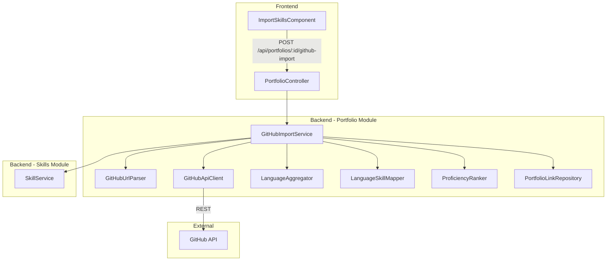

# Design Document: GitHub Profile Import

## Overview

This feature adds GitHub profile language import capability to the Staff Engagement system. A user provides a GitHub profile URL on an employee's portfolio page; the backend fetches all public repositories via the GitHub REST API, aggregates programming language byte counts across repos, maps languages to skill names via configurable mapping, and creates/updates skill entries in the skills module. The feature spans three modules:

- **Portfolio module** — new REST endpoint (`POST /api/portfolios/{employeeId}/github-import`), GitHub API client, import orchestration service, URL storage
- **Skills module** — existing `SkillService` used for create/update/delete of `source = "GITHUB"` skill entries
- **Frontend** — new `ImportSkillsComponent` embedded in the portfolio page with URL input, loading states, and result display

The design prioritises testability (pure functions for URL parsing, aggregation, mapping, proficiency ranking) and resilience (graceful degradation when individual repo language fetches fail).

## Architecture



**Key architectural decisions:**

1. **Pure functions extracted** — URL parsing, language aggregation, skill mapping, and proficiency ranking are stateless pure functions, enabling thorough property-based testing without mocks.
2. **Orchestrator pattern** — `GitHubImportService` coordinates the workflow but delegates each step to focused components.
3. **Resilient fetching** — language fetch failures for individual repos are tolerated; only rate-limit exhaustion halts the entire operation.
4. **Cross-module communication** — `GitHubImportService` in the portfolio module calls `SkillService` (public interface) from the skills module. No direct repository access across module boundaries.

## Components and Interfaces

### 1. GitHubUrlParser (Pure Function)

**Package:** `com.staffengagement.portfolio.github`

```java
public final class GitHubUrlParser {

    public record ParseResult(String username) {}

    /**
     * Validates and parses a GitHub profile URL.
     * Trims whitespace, normalises trailing slashes, validates pattern.
     *
     * @param url raw input URL string (nullable)
     * @return ParseResult with extracted username
     * @throws InvalidGitHubUrlException if URL is null, blank, wrong domain,
     *         has extra path segments, or username is invalid
     */
    public static ParseResult parse(String url) { ... }
}
```

Username rules: alphanumeric + hyphens, 1–39 chars, no leading/trailing/consecutive hyphens.

### 2. GitHubApiClient

**Package:** `com.staffengagement.portfolio.github`

Wraps Spring `RestClient` (or `WebClient`) for GitHub REST API calls. Configured with base URL and PAT from application properties.

```java
public interface GitHubApiClient {
    List<GitHubRepo> fetchPublicRepos(String username);
    Map<String, Long> fetchLanguages(String owner, String repo);
}
```

- Pagination: follows `Link` header up to 10 pages (1000 repos max)
- Timeout: 30s per request
- Auth: `Authorization: Bearer {PAT}` header

### 3. LanguageAggregator (Pure Function)

**Package:** `com.staffengagement.portfolio.github`

```java
public final class LanguageAggregator {

    public record AggregatedLanguage(String name, long totalBytes, int repoCount) {}

    /**
     * Sums byte counts per language across all repo language maps.
     * Order-independent (commutative, associative).
     */
    public static List<AggregatedLanguage> aggregate(
            List<Map<String, Long>> repoLanguageMaps) { ... }
}
```

Returns sorted: descending by `totalBytes`, alphabetical by `name` for ties.

### 4. LanguageSkillMapper (Pure Function)

**Package:** `com.staffengagement.portfolio.github`

```java
public final class LanguageSkillMapper {

    public record MappedSkill(String skillName, long totalBytes, int repoCount) {}

    /**
     * Applies configurable language-to-skill mapping.
     * Case-insensitive lookup. Many-to-one supported (combines counts).
     * Unmapped languages pass through as-is.
     */
    public static List<MappedSkill> map(
            List<AggregatedLanguage> languages,
            Map<String, String> mappingConfig) { ... }
}
```

### 5. ProficiencyRanker (Pure Function)

**Package:** `com.staffengagement.portfolio.github`

```java
public final class ProficiencyRanker {

    /**
     * Assigns proficiency based on rank position:
     * - Rank 1 (top by bytes): EXPERT
     * - Rank 2-3: ADVANCED
     * - Rank 4+: INTERMEDIATE
     * Ties at rank boundaries get the higher proficiency.
     */
    public static Map<String, Proficiency> rank(List<MappedSkill> skills) { ... }
}
```

### 6. GitHubImportService

**Package:** `com.staffengagement.portfolio.github`

Orchestrator. Injects `GitHubApiClient`, `SkillService`, `PortfolioLinkRepository`, and `GitHubImportProperties`.

```java
public interface GitHubImportService {
    ImportResult importFromGitHub(UUID employeeId, String githubProfileUrl);
}
```

Workflow:
1. Validate config (PAT + base URL present) → 503 if not
2. Validate employee exists → 404 if not
3. Parse URL → 400 if invalid
4. Fetch repos (with pagination) → propagate GitHub errors
5. Fetch languages per repo (resilient — skip failures)
6. Aggregate languages
7. Apply mapping
8. Rank proficiencies
9. Upsert skills (create new, update existing, delete stale with `source = "GITHUB"`)
10. Store/update PortfolioLink with label "GitHub"
11. Return `ImportResult`

### 7. GitHubImportProperties

**Package:** `com.staffengagement.portfolio.github`

```java
@ConfigurationProperties(prefix = "github")
public record GitHubImportProperties(
    Api api,
    Map<String, String> languageMapping
) {
    public record Api(String baseUrl, String pat) {}
}
```

Loaded from `application.yml`:
```yaml
github:
  api:
    base-url: https://api.github.com
    pat: ${GITHUB_PAT:}
  language-mapping:
    "Jupyter Notebook": "Python"
    "Shell": "Bash"
```

### 8. ImportResult DTO

```java
public record ImportResult(
    List<ImportedSkill> skills,
    String githubProfileUrl,
    int repositoriesAnalysed,
    List<String> skippedRepositories
) {
    public record ImportedSkill(
        UUID id, String name, int projectCount,
        String proficiency, String source
    ) {}
}
```

### 9. Frontend — ImportSkillsComponent

**Location:** `frontend/src/app/portfolio/components/import-skills/`

Standalone Angular component embedded in `portfolio-view`. Uses reactive forms for URL input. Calls `PortfolioService.importGitHubSkills(employeeId, url)`. Manages loading/error/success states via signals.

### 10. PortfolioService Extension (Frontend)

```typescript
// Added to existing PortfolioService
importGitHubSkills(employeeId: string, githubProfileUrl: string): Observable<ImportResult> {
  return this.http.post<ImportResult>(
    `${this.baseUrl}/portfolios/${employeeId}/github-import`,
    { githubProfileUrl }
  );
}
```

## Data Models

### Skill Entity (existing — `skl_skills`)

No schema changes. The `source` field is added to distinguish GitHub-imported skills:

| Column | Type | Notes |
|--------|------|-------|
| id | UUID | PK |
| employee_id | UUID | FK to employee |
| name | VARCHAR(100) | Skill name |
| years_experience | INT | 0 for GitHub imports |
| project_count | INT | Number of repos using this language |
| proficiency | VARCHAR(20) | Beginner/Intermediate/Advanced/Expert |
| source | VARCHAR(20) | **NEW** — "GITHUB" or "MANUAL" (default "MANUAL") |
| created_at | TIMESTAMP | Auto-set |

**Migration:** Add `source` column with default "MANUAL" to `skl_skills`. Add composite index on `(employee_id, name, source)`.

### PortfolioLink Entity (existing — `prt_links`)

No schema changes. Used as-is to store the GitHub profile URL with `label = "GitHub"`.

### New SkillRepository Query

```java
// Added to SkillRepository
List<Skill> findByEmployeeIdAndSource(UUID employeeId, String source);
Optional<Skill> findByEmployeeIdAndNameAndSource(UUID employeeId, String name, String source);
```

## Correctness Properties

*A property is a characteristic or behavior that should hold true across all valid executions of a system — essentially, a formal statement about what the system should do. Properties serve as the bridge between human-readable specifications and machine-verifiable correctness guarantees.*

### Property 1: URL Parsing Round-Trip

*For any* valid GitHub username (1–39 alphanumeric/hyphen chars, no leading/trailing/consecutive hyphens), constructing `https://github.com/{username}` and parsing it SHALL produce the same username.

**Validates: Requirements 1.1, 1.2**

### Property 2: Invalid URLs Are Rejected

*For any* string that does not match the GitHub profile URL pattern (wrong domain, extra path segments, invalid username characters, query params, fragments), the parser SHALL throw `InvalidGitHubUrlException`.

**Validates: Requirements 1.3, 1.6**

### Property 3: URL Normalization Preserves Semantics

*For any* valid GitHub profile URL with added leading/trailing whitespace or a trailing slash, parsing SHALL produce the same username as the canonical form without whitespace or trailing slash.

**Validates: Requirements 1.5, 1.7**

### Property 4: Language Aggregation Is Commutative

*For any* list of repository language maps, aggregating in any permutation of the list SHALL produce identical results (same languages with same byte counts and repo counts).

**Validates: Requirements 4.4**

### Property 5: Aggregation Sums Are Correct

*For any* list of repository language maps, the total byte count for each language in the aggregated result SHALL equal the sum of that language's byte counts across all input maps, and the repo count SHALL equal the number of input maps containing that language.

**Validates: Requirements 4.1**

### Property 6: Aggregation Sort Order

*For any* aggregated language list, languages SHALL be ordered by total byte count descending; where byte counts are equal, languages SHALL be ordered alphabetically ascending by name.

**Validates: Requirements 4.2**

### Property 7: Case-Insensitive Mapping Lookup

*For any* language name and mapping configuration, looking up the language in any casing (upper, lower, mixed) SHALL return the same mapped skill name.

**Validates: Requirements 5.1**

### Property 8: Unmapped Languages Preserved Exactly

*For any* language name that has no entry in the mapping configuration, the mapped skill name SHALL be identical to the original GitHub language name (preserving casing).

**Validates: Requirements 5.2**

### Property 9: Many-to-One Mapping Combines Counts

*For any* set of languages that map to the same skill name, the resulting mapped skill SHALL have a total byte count equal to the sum of all source languages' byte counts, and a repo count equal to the sum of all source languages' repo counts.

**Validates: Requirements 5.3**

### Property 10: Proficiency Ranking Invariant

*For any* non-empty list of mapped skills sorted by bytes descending, the top skill SHALL receive EXPERT, the 2nd and 3rd SHALL receive ADVANCED, and all remaining SHALL receive INTERMEDIATE. Skills tied at a rank boundary SHALL receive the higher proficiency.

**Validates: Requirements 6.4**

### Property 11: Import Idempotency (No Duplicates)

*For any* employee and import data, running the import twice with the same data SHALL produce the same set of skills (no duplicates created). The second run SHALL update existing entries rather than creating new ones.

**Validates: Requirements 6.3**

### Property 12: Stale Skill Removal

*For any* employee with existing `source = "GITHUB"` skills, after an import that detects a strict subset of the previously imported languages, the resulting skills SHALL contain only the currently detected languages. Skills for languages no longer detected SHALL be removed.

**Validates: Requirements 6.7**

### Property 13: Resilient Fetching Preserves Successful Data

*For any* set of repositories where some language fetches fail (non-rate-limit errors), the aggregation SHALL include language data from all successfully fetched repositories and exclude failed ones. The skipped repository list SHALL contain exactly the failed repository names.

**Validates: Requirements 3.3, 4.5**

### Property 14: GitHub Link Upsert Idempotency

*For any* employee, importing with a GitHub profile URL SHALL result in exactly one PortfolioLink with label "GitHub" for that employee, regardless of how many times the import is run.

**Validates: Requirements 7.1, 7.2**

## Error Handling

| Condition | HTTP Status | Error Message |
|-----------|-------------|---------------|
| URL null/blank/invalid pattern | 400 | "Invalid GitHub profile URL format. Expected: https://github.com/{username}" |
| URL has extra path segments | 400 | "Only GitHub profile URLs are accepted (no repository or tab paths)" |
| Invalid UUID in path | 400 | "Employee ID must be a valid UUID" |
| Missing request body / field | 400 | "githubProfileUrl is required" |
| Employee not found | 404 | "Employee not found: {id}" |
| GitHub user not found (404) | 404 | "GitHub user not found: {username}" |
| Employee archived/deactivated | 409 | "Employee cannot receive skill imports in current state" |
| GitHub rate limit (403) | 429 | "GitHub API rate limit exceeded. Resets at: {reset_time}" |
| GitHub server error (5xx) | 502 | "GitHub API is currently unavailable" |
| GitHub API not configured | 503 | "GitHub integration is not configured (missing PAT or base URL)" |
| GitHub request timeout | 504 | "GitHub API request timed out" |
| Portfolio link persistence failure | 500 | "Failed to save GitHub profile URL" |

All errors follow the project's `@RestControllerAdvice` pattern with consistent JSON format:
```json
{
  "status": 400,
  "error": "Bad Request",
  "message": "Invalid GitHub profile URL format...",
  "timestamp": "2025-01-15T10:30:00Z"
}
```

## Testing Strategy

### Property-Based Tests (jqwik)

The project already uses jqwik 1.9.2. Each correctness property maps to a dedicated property-based test with minimum 100 iterations.

| Property | Test Class | Target |
|----------|------------|--------|
| 1: URL round-trip | `GitHubUrlParserProperties` | `GitHubUrlParser.parse()` |
| 2: Invalid URL rejection | `GitHubUrlParserProperties` | `GitHubUrlParser.parse()` |
| 3: URL normalization | `GitHubUrlParserProperties` | `GitHubUrlParser.parse()` |
| 4: Aggregation commutativity | `LanguageAggregatorProperties` | `LanguageAggregator.aggregate()` |
| 5: Aggregation correctness | `LanguageAggregatorProperties` | `LanguageAggregator.aggregate()` |
| 6: Aggregation sort order | `LanguageAggregatorProperties` | `LanguageAggregator.aggregate()` |
| 7: Case-insensitive mapping | `LanguageSkillMapperProperties` | `LanguageSkillMapper.map()` |
| 8: Unmapped passthrough | `LanguageSkillMapperProperties` | `LanguageSkillMapper.map()` |
| 9: Many-to-one combines | `LanguageSkillMapperProperties` | `LanguageSkillMapper.map()` |
| 10: Proficiency ranking | `ProficiencyRankerProperties` | `ProficiencyRanker.rank()` |
| 11: Import idempotency | `GitHubImportServiceProperties` | `GitHubImportService` (mocked deps) |
| 12: Stale removal | `GitHubImportServiceProperties` | `GitHubImportService` (mocked deps) |
| 13: Resilient fetching | `GitHubApiClientProperties` | `GitHubApiClient` (mock server) |
| 14: Link upsert | `GitHubImportServiceProperties` | `GitHubImportService` (mocked deps) |

**Tag format:** `// Feature: github-profile-import, Property {N}: {title}`

**Configuration:** Each `@Property` annotated method uses `tries = 100` minimum.

### Unit Tests (JUnit 5 + Mockito)

- `GitHubImportServiceTest` — orchestration logic with mocked `GitHubApiClient`, `SkillService`, repositories
- `PortfolioControllerGitHubImportTest` — MockMvc tests for endpoint validation, error responses
- Error mapping tests (GitHub 404 → 404, 403 → 429, 5xx → 502, timeout → 504)
- Configuration validation (missing PAT → 503)

### Integration Tests (Testcontainers + MockWebServer)

- `GitHubImportIntegrationTest` — full workflow with PostgreSQL Testcontainer and MockWebServer for GitHub API
- Verifies skill creation/update/deletion in database
- Verifies PortfolioLink creation/update
- Pagination handling with mock paginated responses

### Frontend Tests

- `ImportSkillsComponent` spec: DOM rendering, loading states, error display, pre-population
- `PortfolioService` spec: HTTP call construction, error propagation
