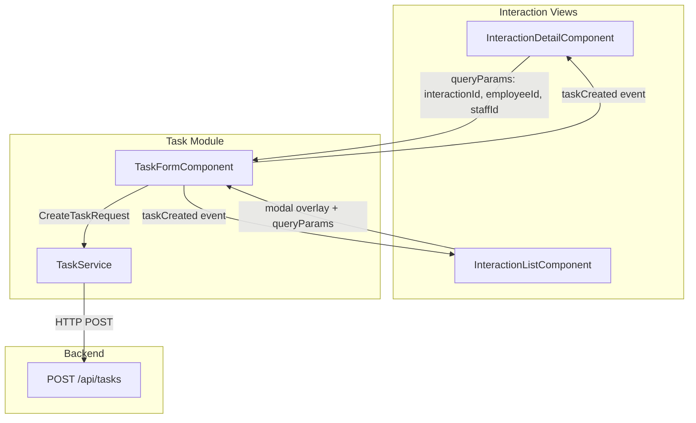
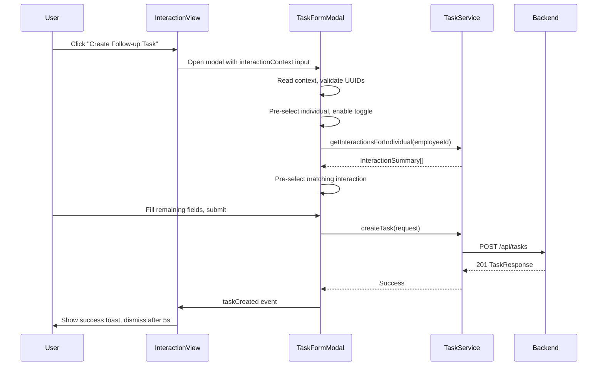
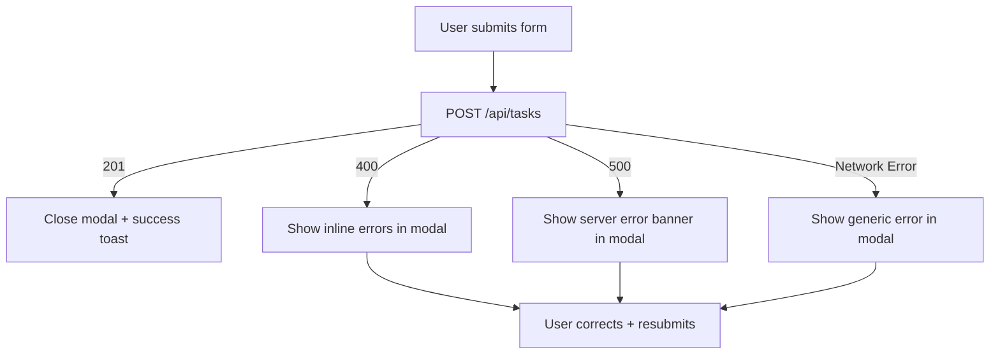

# Design Document: Interaction Follow-Up Task

## Overview

This feature completes the integration between the interaction module and the task module by wiring the existing "Create Follow-up Task" button (interaction detail view) and adding a "Create Task" action (interaction list view) to open the `TaskFormComponent` as a modal overlay with pre-populated interaction context.

The approach is purely frontend — the backend already supports `interactionId` on task creation. The design centers on:
1. Passing interaction context via URL query parameters (stateless, refresh-safe)
2. Enhancing `TaskFormComponent` to read query params and pre-populate fields
3. Rendering the task form as a modal overlay from both interaction views
4. Providing success/error feedback after task creation

## Architecture



### Data Flow



## Components and Interfaces

### Modified Components

#### 1. `TaskFormComponent` (enhanced)

**New Input:**
```typescript
@Input() interactionContext: InteractionContext | null = null;
```

**New Interface:**
```typescript
export interface InteractionContext {
  interactionId: string;
  employeeId: string;
  interactionType?: string;    // for banner display
  interactionDate?: string;    // for banner display
}
```

**Behavior changes:**
- On `ngOnInit`, if `interactionContext` is provided:
  1. Validate both `interactionId` and `employeeId` are valid UUID format
  2. Set `individualId` form control to `employeeId`
  3. Set `linkInteraction` toggle to `true`
  4. Fetch interactions for `employeeId`
  5. Once interactions load, set `interactionId` form control to matching value
  6. Display context banner with type/date
- If only `employeeId` is valid UUID (no `interactionId`): pre-select individual only, leave toggle off
- If only `interactionId` provided (no `employeeId`): ignore, behave as standard form
- If either param is malformed (non-UUID): ignore that param silently

**UUID Validation:**
```typescript
private readonly UUID_REGEX = /^[0-9a-f]{8}-[0-9a-f]{4}-[0-9a-f]{4}-[0-9a-f]{4}-[0-9a-f]{12}$/i;

private isValidUuid(value: string): boolean {
  return this.UUID_REGEX.test(value);
}
```

#### 2. `InteractionDetailComponent` (enhanced)

**Changes:**
- Replace `router.navigate` call in `createFollowUpTask()` with showing `TaskFormComponent` as modal overlay inline
- Pass `InteractionContext` input to the modal
- Add success/error toast state management

**New signals:**
```typescript
showTaskFormModal = signal(false);
successMessage = signal<string | null>(null);
errorMessage = signal<string | null>(null);
```

#### 3. `InteractionListComponent` (enhanced)

**Changes:**
- Add "Create Task" link in Actions column for each row
- Add inline `TaskFormComponent` modal triggered per-row
- Track which interaction triggered the modal via signal
- Add success/error toast state management

**New signals:**
```typescript
showTaskFormModal = signal(false);
taskFormContext = signal<InteractionContext | null>(null);
successMessage = signal<string | null>(null);
```

### New Shared Component

#### `ToastNotificationComponent`

A reusable toast component for success/error messages with auto-dismiss.

```typescript
@Component({ selector: 'app-toast-notification' })
export class ToastNotificationComponent {
  @Input() message: string = '';
  @Input() type: 'success' | 'error' = 'success';
  @Input() autoDismissMs: number = 5000;
  @Output() dismissed = new EventEmitter<void>();
}
```

**Behavior:**
- Renders message with appropriate styling (green for success, red for error)
- Starts auto-dismiss timer on init (`setTimeout` of `autoDismissMs`)
- Provides visible dismiss button (×)
- Clicking dismiss or timer expiry emits `dismissed` event
- Cancels timer on manual dismiss or component destroy

## Data Models

### Existing Models (No Changes)

| Model | Location | Purpose |
|-------|----------|---------|
| `CreateTaskRequest` | `tasks/models/task.model.ts` | Already supports optional `interactionId` |
| `InteractionSummary` | `tasks/models/task.model.ts` | Used by interaction dropdown |
| `InteractionResponse` | `interactions/models/interaction.model.ts` | Source of context data |

### New Interface

```typescript
// tasks/models/task.model.ts
export interface InteractionContext {
  interactionId: string;
  employeeId: string;
  interactionType?: string;
  interactionDate?: string;
}
```

### Query Parameter Contract

| Parameter | Type | Required | Description |
|-----------|------|----------|-------------|
| `interactionId` | UUID string | No | Source interaction ID |
| `employeeId` | UUID string | No | Employee linked to interaction |
| `staffId` | UUID string | No | Staff member on interaction (informational) |

**Validation rules:**
- Both `interactionId` and `employeeId` must be valid UUIDs for full pre-population
- `employeeId` alone (valid UUID) → partial pre-population (individual only)
- `interactionId` alone (valid UUID, no `employeeId`) → ignored entirely
- Malformed value → parameter silently ignored

## Correctness Properties

*A property is a characteristic or behavior that should hold true across all valid executions of a system — essentially, a formal statement about what the system should do. Properties serve as the bridge between human-readable specifications and machine-verifiable correctness guarantees.*

### Property 1: Navigation produces correct query parameters

*For any* interaction with valid `id` and `employeeId` fields, clicking the "Create Follow-up Task" button SHALL produce query parameters where `interactionId` equals the interaction's `id` and `employeeId` equals the interaction's `employeeId`.

**Validates: Requirements 1.1, 5.1**

### Property 2: Every interaction row has a Create Task action

*For any* non-empty list of interactions rendered in the list view, every row in the table SHALL contain a "Create Task" action element.

**Validates: Requirements 2.1**

### Property 3: Full pre-population from valid interaction context

*For any* valid `InteractionContext` (both `interactionId` and `employeeId` are valid UUIDs matching existing records), the Task_Form SHALL have `individualId` set to `employeeId`, `linkInteraction` toggle set to `true`, and after interactions load, `interactionId` set to the provided value.

**Validates: Requirements 3.1, 3.2, 3.3, 5.2**

### Property 4: Changing individual clears interaction and triggers reload

*For any* pre-populated Task_Form state where an individual and interaction are selected, changing the `individualId` to a different employee SHALL clear the `interactionId` field and trigger a new fetch of interactions for the newly selected employee.

**Validates: Requirements 3.5, 4.4**

### Property 5: Toggle off clears interaction selection

*For any* Task_Form state where `linkInteraction` is `true` and an interaction is selected, setting `linkInteraction` to `false` SHALL clear the `interactionId` form control value to empty.

**Validates: Requirements 4.3**

### Property 6: Submission with toggle off omits interactionId

*For any* valid form submission where `linkInteraction` is `false`, the `CreateTaskRequest` payload sent to the backend SHALL NOT contain an `interactionId` field (or it shall be `undefined`).

**Validates: Requirements 4.5**

### Property 7: Partial context (employeeId only) pre-populates individual only

*For any* valid UUID `employeeId` provided without an `interactionId`, the Task_Form SHALL set `individualId` to that value, leave `linkInteraction` as `false`, and not pre-select any interaction.

**Validates: Requirements 5.3**

### Property 8: InteractionId without employeeId is ignored

*For any* valid UUID `interactionId` provided without a valid `employeeId`, the Task_Form SHALL behave identically to having no interaction context — `individualId` empty, `linkInteraction` false, no interaction selected.

**Validates: Requirements 5.4**

### Property 9: Malformed UUID parameters are silently ignored

*For any* string that does not match the UUID format (`/^[0-9a-f]{8}-[0-9a-f]{4}-[0-9a-f]{4}-[0-9a-f]{4}-[0-9a-f]{12}$/i`), when provided as a query parameter value, the Task_Form SHALL ignore that parameter and any dependent parameter, producing default form state for the ignored fields.

**Validates: Requirements 5.5**

## Error Handling

| Scenario | Component | Behavior |
|----------|-----------|----------|
| Interaction data fails to load | InteractionDetailComponent | Hide "Create Follow-up Task" button entirely |
| Employee from context not found in employee list | TaskFormComponent | Leave individual field empty, no error shown, allow manual selection |
| Interaction from context not found in loaded list | TaskFormComponent | Enable toggle, leave dropdown unselected |
| Task creation returns 400 (validation) | TaskFormComponent | Show inline field errors, keep modal open, preserve form data |
| Task creation returns 500 (server error) | TaskFormComponent | Show server error banner in modal, keep open for retry |
| Task creation succeeds | InteractionDetailComponent / InteractionListComponent | Close modal, show success toast |
| Network error during task creation | TaskFormComponent | Show generic error message, keep modal open |

### Error Flow Detail



## Testing Strategy

### Property-Based Tests (fast-check)

Property-based testing is appropriate here because:
- UUID validation has a large input space (valid/invalid string combinations)
- Pre-population logic varies meaningfully with different context combinations
- Form state transitions depend on input combinations that benefit from randomized exploration

**Library:** `fast-check` (already available in Node/Angular ecosystem)
**Minimum iterations:** 100 per property test
**Tag format:** `Feature: interaction-follow-up-task, Property {N}: {description}`

Each correctness property (1–9) maps to a single property-based test verifying the universal quantification holds across generated inputs.

### Unit Tests (Jasmine/Karma)

| Area | Tests |
|------|-------|
| TaskFormComponent pre-population | Verify banner rendering, field editability, toggle/individual change behavior |
| InteractionDetailComponent | Button visibility during loading/error/success states |
| InteractionListComponent | "Create Task" action rendering, modal open/close |
| ToastNotificationComponent | Auto-dismiss timer (5s), manual dismiss, cancel timer on destroy |
| UUID validation helper | Exact boundary cases (valid v4, invalid formats, empty string, null) |

### Integration Tests

| Scenario | Approach |
|----------|----------|
| Full flow: detail view → modal → submit → toast | TestBed with mocked TaskService, verify end-to-end DOM changes |
| Full flow: list view → modal → submit → toast | Same approach from list context |
| Query param refresh | Simulate ActivatedRoute with queryParams, verify form state after init |
| Modal close preserves parent state | Open modal, close, verify filters/scroll/URL unchanged |

### Test Boundaries

- **No backend tests needed** — backend already handles `interactionId` on task creation
- **No E2E tests in this spec** — covered by existing task creation E2E when extended
- **Focus: frontend component interaction and state management**
