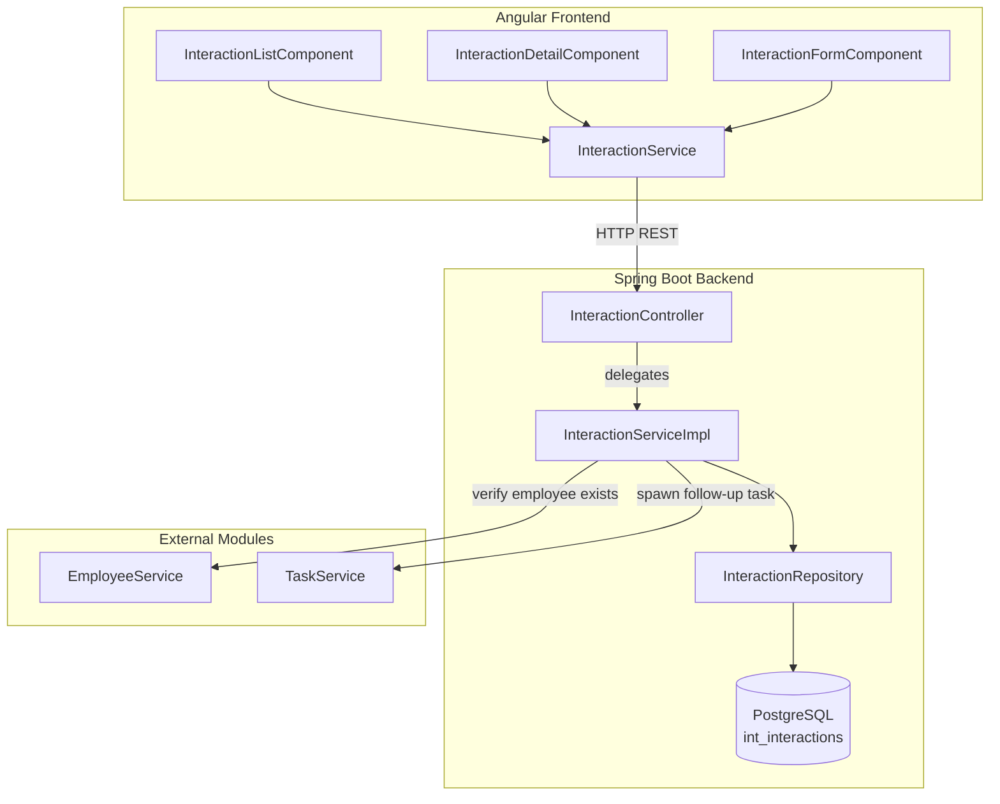
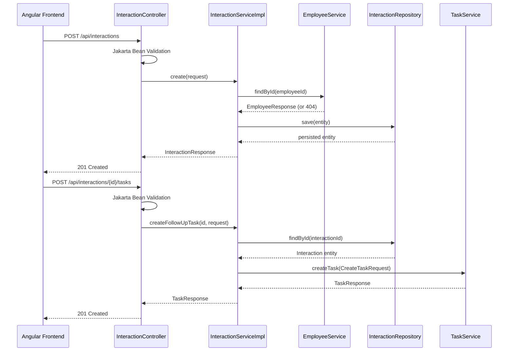

# Design Document: Interaction Module

## Overview

The Interaction Module provides full lifecycle management of engagement records (check-ins, mentoring sessions, catch-ups, performance reviews, informal interactions) between staff members and employees. It integrates with the existing modular monolith by following established patterns: Spring Boot service interface for inter-module communication, JPA entities with `int_` table prefix, Jakarta Bean Validation at the controller boundary, and DTO-based request/response contracts.

The module extends the existing partial implementation (basic CRUD entity, repository, controller) to include:
- Complete validation (type enum, future-date rejection, field length enforcement)
- Update and delete operations with appropriate semantics
- Follow-up task spawning via delegation to the Task module
- Pagination and multi-criteria filtering (employee, type, date range)
- Audit timestamps (createdAt immutable, updatedAt auto-maintained)
- Angular frontend with list, detail, and form views using standalone components, lazy-loaded routes, and reactive forms

### Key Design Decisions

1. **InteractionType as Java enum** — Enforced at both validation and database levels (PostgreSQL CHECK constraint), eliminating invalid state at the data layer.
2. **Task delegation, not ownership** — The interaction module calls `TaskService.createTask(...)` rather than owning task persistence. This preserves module boundaries.
3. **Spring Data JPA Specifications** — Used for dynamic multi-filter queries (employeeId + type + date range) without N query methods or raw SQL.
4. **`updatedAt` via `@PreUpdate`** — JPA lifecycle callback ensures consistent timestamp management without scattering clock logic across service methods.
5. **Paginated response as `Page<InteractionResponse>`** — Leverages Spring Data's built-in `Pageable` support, reducing boilerplate for pagination metadata.

## Architecture



### Request Flow



## Components and Interfaces

### Backend Components

| Component | Package | Responsibility |
|-----------|---------|---------------|
| `InteractionController` | `interaction.controller` | HTTP layer: validation, status codes, request routing |
| `InteractionService` (interface) | `interaction.service` | Public API for inter-module calls |
| `InteractionServiceImpl` | `interaction.service` | Business logic: validation, entity mapping, delegation |
| `InteractionRepository` | `interaction.repository` | Spring Data JPA repo with `JpaSpecificationExecutor` |
| `Interaction` (entity) | `interaction.model` | JPA entity mapped to `int_interactions` |
| `InteractionType` (enum) | `interaction.model` | `CHECK_IN, MENTORING, CATCH_UP, PERFORMANCE_REVIEW, INFORMAL` |
| `InteractionSpecifications` | `interaction.repository` | Dynamic query predicates for filtering |
| DTOs | `interaction.dto` | `CreateInteractionRequest`, `UpdateInteractionRequest`, `CreateFollowUpTaskRequest`, `InteractionResponse`, `InteractionPageResponse` |

### Frontend Components

| Component | Path | Responsibility |
|-----------|------|---------------|
| `InteractionListComponent` | `interactions/components/interaction-list/` | Paginated list with filtering |
| `InteractionDetailComponent` | `interactions/components/interaction-detail/` | Full record view with task spawn button |
| `InteractionFormComponent` | `interactions/components/interaction-form/` | Create/edit reactive form |
| `InteractionService` | `interactions/services/` | HTTP client for interaction API |
| Models/interfaces | `interactions/models/` | TypeScript interfaces for API contracts |

### Service Interface (Public Contract)

```java
public interface InteractionService {
    InteractionResponse create(CreateInteractionRequest request);
    InteractionResponse update(UUID id, UpdateInteractionRequest request);
    InteractionResponse findById(UUID id);
    Page<InteractionResponse> findAll(UUID employeeId, InteractionType type,
                                       LocalDateTime fromDate, LocalDateTime toDate,
                                       Pageable pageable);
    void delete(UUID id);
    TaskResponse createFollowUpTask(UUID interactionId, CreateFollowUpTaskRequest request);
}
```

### REST API Endpoints

| Method | Path | Request Body | Query Params | Response |
|--------|------|-------------|--------------|----------|
| `POST` | `/api/interactions` | `CreateInteractionRequest` | — | `201` + `InteractionResponse` |
| `GET` | `/api/interactions/{id}` | — | — | `200` + `InteractionResponse` |
| `GET` | `/api/interactions` | — | `employeeId`, `type`, `fromDate`, `toDate`, `page`, `size` | `200` + `Page<InteractionResponse>` |
| `PUT` | `/api/interactions/{id}` | `UpdateInteractionRequest` | — | `200` + `InteractionResponse` |
| `DELETE` | `/api/interactions/{id}` | — | — | `204` No Content |
| `POST` | `/api/interactions/{id}/tasks` | `CreateFollowUpTaskRequest` | — | `201` + `TaskResponse` |

## Data Models

### Entity: `Interaction`

Table: `int_interactions`

| Column | Type | Constraints | Notes |
|--------|------|-------------|-------|
| `id` | `UUID` | PK, auto-generated | `GenerationType.UUID` |
| `employee_id` | `UUID` | NOT NULL, FK → `emp_employees.id` | ON DELETE RESTRICT |
| `staff_id` | `UUID` | NOT NULL, FK → `stf_staff.id` | ON DELETE RESTRICT |
| `type` | `VARCHAR(20)` | NOT NULL, CHECK constraint | Enum values only |
| `notes` | `TEXT` | nullable, max 5000 chars | Application + DB check |
| `occurred_at` | `TIMESTAMP` | NOT NULL | Must be ≤ current time at persistence |
| `created_at` | `TIMESTAMP` | NOT NULL, immutable | Set via `@PrePersist` |
| `updated_at` | `TIMESTAMP` | NOT NULL | Set via `@PrePersist`, updated via `@PreUpdate` |

### Enum: `InteractionType`

```java
public enum InteractionType {
    CHECK_IN, MENTORING, CATCH_UP, PERFORMANCE_REVIEW, INFORMAL
}
```

### DTO: `CreateInteractionRequest`

```java
public record CreateInteractionRequest(
    @NotNull UUID employeeId,
    @NotNull UUID staffId,
    @NotNull InteractionType type,
    @Size(max = 5000) String notes,
    @NotNull @PastOrPresent LocalDateTime occurredAt
) {}
```

### DTO: `UpdateInteractionRequest`

```java
public record UpdateInteractionRequest(
    @NotNull InteractionType type,
    @Size(max = 5000) String notes,
    @NotNull @PastOrPresent LocalDateTime occurredAt
) {}
```

### DTO: `CreateFollowUpTaskRequest`

```java
public record CreateFollowUpTaskRequest(
    @NotBlank @Size(max = 255) String title,
    @Size(max = 2000) String description,
    @FutureOrPresent LocalDate dueDate
) {}
```

### DTO: `InteractionResponse`

```java
public record InteractionResponse(
    UUID id,
    UUID employeeId,
    UUID staffId,
    InteractionType type,
    String notes,
    LocalDateTime occurredAt,
    LocalDateTime createdAt,
    LocalDateTime updatedAt
) {}
```

### Frontend TypeScript Models

```typescript
export type InteractionType = 'CHECK_IN' | 'MENTORING' | 'CATCH_UP' | 'PERFORMANCE_REVIEW' | 'INFORMAL';

export interface InteractionResponse {
  id: string;
  employeeId: string;
  staffId: string;
  type: InteractionType;
  notes: string | null;
  occurredAt: string;
  createdAt: string;
  updatedAt: string;
}

export interface CreateInteractionRequest {
  employeeId: string;
  staffId: string;
  type: InteractionType;
  notes?: string;
  occurredAt: string;
}

export interface UpdateInteractionRequest {
  type: InteractionType;
  notes?: string;
  occurredAt: string;
}

export interface CreateFollowUpTaskRequest {
  title: string;
  description?: string;
  dueDate?: string;
}

export interface PageResponse<T> {
  content: T[];
  totalElements: number;
  totalPages: number;
  number: number;
  size: number;
}
```

### Liquibase Migration

```sql
-- int_interactions table
CREATE TABLE int_interactions (
    id              UUID PRIMARY KEY DEFAULT gen_random_uuid(),
    employee_id     UUID NOT NULL REFERENCES emp_employees(id) ON DELETE RESTRICT,
    staff_id        UUID NOT NULL REFERENCES stf_staff(id) ON DELETE RESTRICT,
    type            VARCHAR(20) NOT NULL CHECK (type IN ('CHECK_IN','MENTORING','CATCH_UP','PERFORMANCE_REVIEW','INFORMAL')),
    notes           TEXT CHECK (char_length(notes) <= 5000),
    occurred_at     TIMESTAMP NOT NULL,
    created_at      TIMESTAMP NOT NULL DEFAULT now(),
    updated_at      TIMESTAMP NOT NULL DEFAULT now()
);

CREATE INDEX idx_int_interactions_employee_id ON int_interactions(employee_id);
CREATE INDEX idx_int_interactions_staff_id ON int_interactions(staff_id);
CREATE INDEX idx_int_interactions_occurred_at ON int_interactions(occurred_at DESC);
CREATE INDEX idx_int_interactions_type ON int_interactions(type);
```


## Correctness Properties

*A property is a characteristic or behavior that should hold true across all valid executions of a system — essentially, a formal statement about what the system should do. Properties serve as the bridge between human-readable specifications and machine-verifiable correctness guarantees.*

### Property 1: Create-retrieve round-trip

*For any* valid `CreateInteractionRequest` with a valid employeeId, staffId, type from the InteractionType enum, notes within 5000 characters, and occurredAt not in the future, creating the interaction and then retrieving it by the returned ID SHALL yield a response where employeeId, staffId, type, notes, and occurredAt are equal to the original request values.

**Validates: Requirements 1.1, 2.1**

### Property 2: Invalid interaction type rejection

*For any* string value that is not one of {CHECK_IN, MENTORING, CATCH_UP, PERFORMANCE_REVIEW, INFORMAL}, submitting it as the type field in a create or update request SHALL result in HTTP 400 rejection.

**Validates: Requirements 1.5, 3.3**

### Property 3: Future occurredAt rejection

*For any* LocalDateTime value that is strictly after the server's current time, submitting it as the occurredAt field in a create or update request SHALL result in HTTP 400 rejection.

**Validates: Requirements 1.7, 3.4, 10.4**

### Property 4: employeeId and staffId immutability on update

*For any* existing interaction and *for any* update request that includes different employeeId or staffId values in the body, the response after update SHALL still contain the original employeeId and staffId assigned at creation time.

**Validates: Requirements 3.5**

### Property 5: createdAt immutability and updatedAt advancement

*For any* existing interaction, after applying N update operations (N ≥ 1), the createdAt timestamp SHALL remain identical to its initial value, and the updatedAt timestamp SHALL be greater than or equal to the pre-update updatedAt value.

**Validates: Requirements 7.1, 7.2**

### Property 6: Delete-then-retrieve yields not-found

*For any* successfully created interaction, after a successful DELETE request for that interaction's ID, a subsequent GET request for the same ID SHALL result in HTTP 404.

**Validates: Requirements 4.1**

### Property 7: Field length limit enforcement

*For any* string with length exceeding 5000 characters submitted as notes (create or update), OR *for any* string with length exceeding 255 characters submitted as task title, OR *for any* string with length exceeding 2000 characters submitted as task description, the system SHALL reject the request with HTTP 400.

**Validates: Requirements 3.6, 5.4, 5.5, 10.6**

### Property 8: Pagination metadata consistency

*For any* set of N interaction records and *for any* page/size request where size ≥ 1, the returned pagination response SHALL satisfy: totalElements = N, totalPages = ⌈N / size⌉, content.length ≤ min(size, 100), and number = requested page.

**Validates: Requirements 6.1**

### Property 9: Page size capped at 100

*For any* list request with a size parameter greater than 100, the response content SHALL contain at most 100 elements regardless of the requested size value.

**Validates: Requirements 6.3**

### Property 10: Combined filter AND semantics

*For any* combination of filter parameters (employeeId, type, fromDate, toDate) applied to a list request, every interaction in the response SHALL satisfy ALL provided filter predicates simultaneously: if employeeId is specified, the record's employeeId matches; if type is specified, the record's type matches; if fromDate/toDate are specified, the record's occurredAt falls within [fromDate, toDate] inclusive.

**Validates: Requirements 6.4, 6.6, 6.8, 2.2**

### Property 11: List ordering by occurredAt descending

*For any* list/paginated response containing more than one interaction, the occurredAt values SHALL be in non-ascending order (each element's occurredAt ≥ the next element's occurredAt).

**Validates: Requirements 2.2, 2.3, 6.1**

### Property 12: Invalid date range rejection

*For any* pair of date values where fromDate is strictly after toDate, submitting them as filter parameters in a list request SHALL result in HTTP 400 rejection.

**Validates: Requirements 6.7**

### Property 13: Past due date rejection for follow-up tasks

*For any* LocalDate value that is strictly before today, submitting it as the dueDate in a follow-up task creation request SHALL result in HTTP 400 rejection.

**Validates: Requirements 5.6**

### Property 14: Notes preview truncation

*For any* notes string with length greater than 100 characters, the list view preview SHALL display exactly the first 100 characters followed by "...". *For any* notes string with length ≤ 100 characters, the preview SHALL display the full text without modification.

**Validates: Requirements 8.2**

### Property 15: createdAt equals updatedAt on fresh creation

*For any* newly created interaction, the response SHALL have createdAt exactly equal to updatedAt, confirming no modification has occurred since initial persistence.

**Validates: Requirements 7.4**

## Error Handling

### Global Exception Handling

The module integrates with the existing `@RestControllerAdvice` global exception handler:

| Exception | HTTP Status | Response Body |
|-----------|-------------|---------------|
| `MethodArgumentNotValidException` | 400 | Field-level validation errors (field name + message) |
| `InteractionNotFoundException` | 404 | `{ "error": "Interaction not found", "id": "..." }` |
| `EmployeeNotFoundException` | 404 | `{ "error": "Employee not found", "id": "..." }` |
| `StaffNotFoundException` | 404 | `{ "error": "Staff member not found", "id": "..." }` |
| `InvalidDateRangeException` | 400 | `{ "error": "fromDate must be on or before toDate" }` |
| `TaskCreationFailedException` | 500 | `{ "error": "Failed to create follow-up task" }` |
| `ConstraintViolationException` | 400 | Validation constraint details |
| `MethodArgumentTypeMismatchException` | 400 | `{ "error": "Invalid UUID format" }` |

### Custom Exceptions

```java
// In interaction.exception package
public class InteractionNotFoundException extends RuntimeException {
    public InteractionNotFoundException(UUID id) {
        super("Interaction not found: " + id);
    }
}

public class InvalidDateRangeException extends RuntimeException {
    public InvalidDateRangeException() {
        super("fromDate must be on or before toDate");
    }
}

public class TaskCreationFailedException extends RuntimeException {
    public TaskCreationFailedException(String cause) {
        super("Failed to create follow-up task: " + cause);
    }
}
```

### Frontend Error Handling

- **Network errors / HTTP 5xx**: Display toast/banner with retry button; component stays in current state
- **HTTP 400 (validation)**: Map server field errors to form control errors for inline display
- **HTTP 404 (not found)**: Display not-found message with navigation back to list
- **Loading states**: Show spinner/skeleton during API calls; disable form submit button during submission

## Testing Strategy

### Backend Testing

**Unit Tests** (JUnit 5 + Mockito):
- `InteractionServiceImplTest` — test business logic with mocked repository and module services
- Validation logic for date ranges, type enum, field lengths
- DTO mapping correctness
- Exception scenarios (not found, delegation failures)

**Integration Tests** (Spring Boot + Testcontainers PostgreSQL):
- `InteractionControllerIntegrationTest` — full request lifecycle via `MockMvc`
- Database constraint verification (FK RESTRICT, CHECK constraints)
- Pagination and filtering with real data
- Follow-up task delegation with real TaskService

**Property-Based Tests** (jqwik):
- Library: **jqwik** (already evidenced by `.jqwik-database` file in project)
- Minimum 100 iterations per property
- Each test tagged with property reference
- Tag format: `Feature: interaction-module, Property {number}: {property_text}`

Properties to implement as PBT:
- Property 1: Create-retrieve round-trip
- Property 2: Invalid type rejection
- Property 3: Future occurredAt rejection
- Property 4: employeeId/staffId immutability
- Property 5: createdAt immutability + updatedAt advancement
- Property 7: Field length enforcement
- Property 8: Pagination metadata consistency
- Property 9: Page size cap
- Property 10: Combined filter AND semantics
- Property 11: List ordering
- Property 14: Notes preview truncation
- Property 15: createdAt == updatedAt on creation

Properties requiring integration context (tested with Testcontainers):
- Properties 1, 4, 5, 6, 8, 9, 10, 11, 15 (require persistence)

Properties testable as pure unit PBT:
- Properties 2, 3, 7, 14 (validation logic, string truncation)

### Frontend Testing

**Unit Tests** (Vitest + Angular TestBed):
- `InteractionService` — mock HTTP calls, verify request/response mapping
- `InteractionListComponent` — rendering, pagination controls, filter application
- `InteractionDetailComponent` — data display, error states
- `InteractionFormComponent` — reactive form validation, submission flow

**Component Tests**:
- Verify loading/error/empty states render correctly
- Verify form validators (required fields, max lengths, date constraints)
- Verify navigation behavior on success/failure

### Test File Locations

```
backend/src/test/java/com/staffengagement/interaction/
├── controller/InteractionControllerIntegrationTest.java
├── service/InteractionServiceImplTest.java
├── service/InteractionServicePropertyTest.java
└── repository/InteractionRepositoryTest.java

frontend/src/app/interactions/
├── services/interaction.service.spec.ts
├── components/interaction-list/interaction-list.component.spec.ts
├── components/interaction-detail/interaction-detail.component.spec.ts
└── components/interaction-form/interaction-form.component.spec.ts
```
