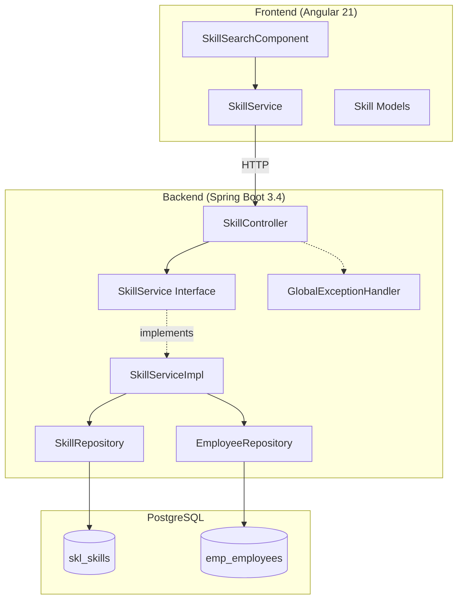
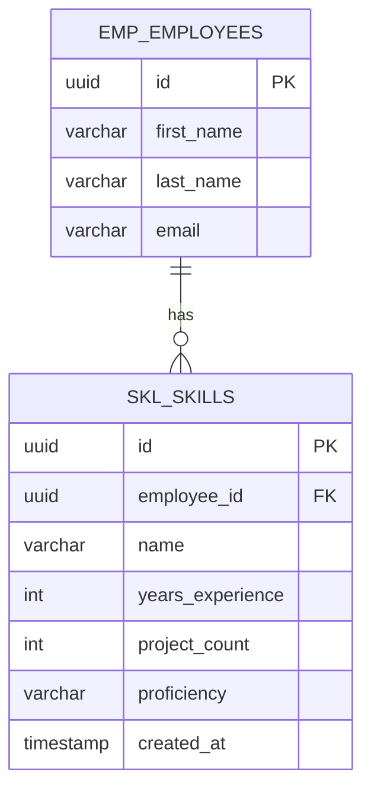

# Design Document: Skills Register

## Overview

The Skills Register is a full-stack feature within the Staff Engagement modular monolith that tracks and exposes technical competencies across the organisation. It allows authenticated users to search for skills (e.g. "Angular", "Java"), view ranked lists of employees possessing that skill, and manage individual skill records via CRUD operations.

The backend is a Spring Boot module (`com.staffengagement.skills`) that owns the `skl_skills` table and exposes a RESTful API. The frontend is an Angular standalone component at the `/skills` route providing a search interface with ranked results and proficiency badges.

Key design decisions:
- **Modular isolation** — the skills module owns its entity, repository, service, and controller. It references the employee module's repository for search joins only.
- **In-memory ranking** — search results are sorted in the service layer (years desc, projects desc) rather than via a database query, keeping the repository simple.
- **Case-insensitive partial matching** — leverages Spring Data JPA's derived query `findByNameContainingIgnoreCase` for search.
- **Record DTOs** — all request/response DTOs are Java records with Jakarta Bean Validation annotations.

## Architecture



### Request Flow

1. User enters a search query in `SkillSearchComponent`
2. `SkillService` (frontend) sends `GET /api/skills/search?query=X`
3. `SkillController` delegates to `SkillServiceImpl.search()`
4. Repository performs case-insensitive partial match on `skl_skills.name`
5. Service joins with `EmployeeRepository` to enrich results with employee details
6. Results are sorted in-memory by years experience desc, then project count desc
7. Sorted `SkillSearchResult` list returned as JSON

## Components and Interfaces

### Backend Components

#### Entity: `Skill`
- JPA entity mapped to `skl_skills` table
- UUID primary key, auto-generated via `GenerationType.UUID`
- `createdAt` set via `@PrePersist` lifecycle callback
- Fields: `id`, `employeeId`, `name`, `yearsExperience`, `projectCount`, `proficiency`, `createdAt`

#### Repository: `SkillRepository`
- Extends `JpaRepository<Skill, UUID>`
- Derived query methods:
  - `findByEmployeeId(UUID)` — retrieve all skills for an employee
  - `findByName(String)` — exact name match (case-sensitive)
  - `findByNameContainingIgnoreCase(String)` — partial match for search

#### Service Interface: `SkillService`
```java
public interface SkillService {
    List<SkillResponse> findByEmployeeId(UUID employeeId);
    List<SkillResponse> findByName(String name);
    List<SkillSearchResult> search(String query);
    SkillResponse create(CreateSkillRequest request);
    SkillResponse update(UUID id, UpdateSkillRequest request);
    void delete(UUID id);
}
```

#### Service Implementation: `SkillServiceImpl`
- Package-private class annotated with `@Service`
- Constructor-injected with `SkillRepository` and `EmployeeRepository`
- `search()`: fetches matching skills, joins each with employee data, filters nulls (orphaned records), sorts by years desc then projects desc
- `create()`: maps DTO to entity, persists, returns response
- `update()`: finds by ID (throws `EntityNotFoundException` if missing), updates fields, persists
- `delete()`: checks existence (throws `EntityNotFoundException` if missing), deletes by ID

#### Controller: `SkillController`
- `@RestController` at `/api/skills`
- Package-private class
- Endpoints:
  - `GET /api/skills?employeeId={uuid}` → `byEmployee()`
  - `GET /api/skills?name={string}` → `byName()`
  - `GET /api/skills/search?query={string}` → `search()`
  - `POST /api/skills` → `create()` (201 Created)
  - `PUT /api/skills/{id}` → `update()`
  - `DELETE /api/skills/{id}` → `delete()` (204 No Content)
- Uses `@Valid` on request bodies for Bean Validation

#### DTOs (Java Records)

| Record | Fields | Validation |
|--------|--------|------------|
| `CreateSkillRequest` | `employeeId`, `name`, `yearsExperience`, `projectCount`, `proficiency` | `@NotNull`, `@NotBlank`, `@Min(0)` |
| `UpdateSkillRequest` | `name`, `yearsExperience`, `projectCount`, `proficiency` | `@NotBlank`, `@Min(0)` |
| `SkillResponse` | `id`, `employeeId`, `name`, `yearsExperience`, `projectCount`, `proficiency`, `createdAt` | — |
| `SkillSearchResult` | `employeeFirstName`, `employeeLastName`, `employeeEmail`, `skillName`, `yearsExperience`, `projectCount`, `proficiency` | — |

### Frontend Components

#### `SkillSearchComponent`
- Standalone Angular component at `/skills` route (lazy-loaded)
- Uses `FormsModule` for template-driven `[(ngModel)]` on search input
- State managed via Angular signals: `results`, `hasSearched`, `isLoading`
- Displays results in an HTML table with sequential rank numbers
- Proficiency badges use `[attr.data-level]` binding with CSS colour coding

#### `SkillService` (Frontend)
- Injectable service using `HttpClient`
- Methods: `findByEmployee()`, `search()`, `create()`, `update()`, `delete()`
- Base URL from `environment.apiUrl`

#### Models (TypeScript Interfaces)
- `Skill`, `CreateSkillRequest`, `UpdateSkillRequest`, `SkillSearchResult`
- Mirror the backend DTOs exactly

### Cross-Cutting Concerns

#### `GlobalExceptionHandler`
- `@RestControllerAdvice` handling:
  - `EntityNotFoundException` → 404
  - `MethodArgumentNotValidException` → 400 with field-level errors
  - `BadCredentialsException` → 401
  - `AccessDeniedException` → 403
  - `IllegalArgumentException` → 409
  - Generic `Exception` → 500
- Returns consistent `ErrorResponse` record: `{ status, message, errors[], timestamp }`

#### Security
- JWT authentication filter applied globally
- Skills endpoints accessible to all authenticated users (no role restriction)
- Unauthenticated requests receive 401 before reaching the controller

## Data Models

### Database Schema: `skl_skills`

| Column | Type | Constraints |
|--------|------|------------|
| `id` | `uuid` | PK, NOT NULL |
| `employee_id` | `uuid` | NOT NULL |
| `name` | `varchar(255)` | NOT NULL |
| `years_experience` | `int` | DEFAULT 0 |
| `project_count` | `int` | DEFAULT 0 |
| `proficiency` | `varchar(255)` | NOT NULL |
| `created_at` | `timestamp` | NOT NULL |

Managed via Liquibase changeset `006-create-skl-skills`.

### Domain Relationships



Note: No explicit foreign key constraint exists in the migration — the relationship is enforced at the application layer (orphaned skills are filtered out during search).


## Correctness Properties

*A property is a characteristic or behavior that should hold true across all valid executions of a system — essentially, a formal statement about what the system should do. Properties serve as the bridge between human-readable specifications and machine-verifiable correctness guarantees.*

### Property 1: Search returns correct partial matches with complete data

*For any* set of skills in the database and any non-empty search query string, every result returned by `search(query)` SHALL have a skill name containing the query (case-insensitive), and SHALL include the correct employee first name, last name, email, skill name, years of experience, project count, and proficiency matching the source records.

**Validates: Requirements 1.1, 1.2**

### Property 2: Search results are ranked correctly

*For any* list of search results returned by `search(query)`, for every consecutive pair of results (i, i+1), result[i].yearsExperience >= result[i+1].yearsExperience, and when yearsExperience values are equal, result[i].projectCount >= result[i+1].projectCount.

**Validates: Requirements 1.3**

### Property 3: Whitespace-only queries produce no results

*For any* string composed entirely of whitespace characters (spaces, tabs, newlines, of any length > 0), submitting it as a search query SHALL return an empty result set without executing a database search.

**Validates: Requirements 1.5**

### Property 4: Search results bounded at 50

*For any* search query that matches more than 50 skill records in the database, the returned result set SHALL contain at most 50 entries.

**Validates: Requirements 1.8**

### Property 5: Employee skill retrieval returns complete sorted set

*For any* employee with N associated skill records (N >= 0), calling `findByEmployeeId(employeeId)` SHALL return exactly N results, and those results SHALL be ordered alphabetically by skill name (ascending).

**Validates: Requirements 2.1**

### Property 6: Create round-trip preserves data

*For any* valid `CreateSkillRequest` with a name (1-100 chars), yearsExperience (0-50), projectCount (0-500), proficiency in {Beginner, Intermediate, Advanced, Expert}, and a valid employeeId referencing an existing employee, the returned `SkillResponse` SHALL have a non-null UUID id, a non-null createdAt timestamp, and all other fields identical to the input request.

**Validates: Requirements 3.1**

### Property 7: Update round-trip reflects new values

*For any* existing skill record and any valid `UpdateSkillRequest`, after calling `update(id, request)`, the returned `SkillResponse` SHALL have name, yearsExperience, projectCount, and proficiency equal to the values in the update request, while preserving the original id and employeeId.

**Validates: Requirements 4.1**

### Property 8: Delete removes record permanently

*For any* existing skill record, after calling `delete(id)`, a subsequent `findByEmployeeId` for that employee SHALL NOT include the deleted skill's id in its results.

**Validates: Requirements 5.1**

### Property 9: Exact name match is case-sensitive

*For any* set of skills with varying name casing (e.g. "Angular", "angular", "ANGULAR"), calling `findByName(exactName)` SHALL return only records where the name field is byte-for-byte equal to the provided value.

**Validates: Requirements 6.1**

### Property 10: UI renders complete result rows

*For any* non-empty array of `SkillSearchResult` objects, the rendered table SHALL contain one row per result with: a sequential rank number starting at 1, the employee's full name, email, years of experience, project count, and a proficiency badge element with the correct `data-level` attribute.

**Validates: Requirements 7.1**

## Error Handling

### Backend Error Strategy

All errors are handled centrally via `GlobalExceptionHandler` (`@RestControllerAdvice`). Every error response uses a consistent `ErrorResponse` record:

```java
public record ErrorResponse(int status, String message, List<String> errors, LocalDateTime timestamp) {}
```

| Exception | HTTP Status | Scenario |
|-----------|-------------|----------|
| `MethodArgumentNotValidException` | 400 | Bean Validation failures (blank name, negative years, etc.) |
| `EntityNotFoundException` | 404 | Skill not found on update/delete |
| `BadCredentialsException` | 401 | Invalid authentication |
| `AccessDeniedException` | 403 | Insufficient permissions |
| `IllegalArgumentException` | 409 | Business rule conflicts |
| `Exception` (catch-all) | 500 | Unexpected server errors |

### Frontend Error Strategy

- `SkillSearchComponent` catches HTTP errors in the `subscribe({ error })` callback
- On error: sets `isLoading` signal to `false`, hides loading indicator
- Currently displays no explicit error message to the user (future enhancement: surface error text)

### Validation Rules (Input Rejection)

| Field | Rule | Error |
|-------|------|-------|
| `name` | Not blank, max 100 chars | 400 — field-level message |
| `employeeId` | Not null, valid UUID | 400 — field-level message |
| `yearsExperience` | Integer, 0–50 | 400 — field-level message |
| `projectCount` | Integer, 0–500 | 400 — field-level message |
| `proficiency` | Not blank, valid enum value | 400 — field-level message |

## Testing Strategy

### Unit Tests (JUnit 5 + Mockito)

- **SkillServiceImpl**: Mock `SkillRepository` and `EmployeeRepository`
  - `search()`: verify filtering, joining, sorting, and max-50 limit
  - `create()`: verify entity mapping, persistence call, response mapping
  - `update()`: verify find-or-throw, field updates, persistence
  - `delete()`: verify existence check, deletion call, exception on missing

- **Frontend SkillService**: Mock `HttpClient` responses
  - Verify correct URL construction and params for each method

- **SkillSearchComponent**: TestBed with mocked SkillService
  - Verify signal state transitions (isLoading, hasSearched, results)
  - Verify template renders rows, badges, loading state, empty state

### Property-Based Tests (jqwik for Java, fast-check for TypeScript)

Each correctness property is implemented as a property-based test with minimum 100 iterations:

- **Property 1-4, 6, 9**: Test `SkillServiceImpl` with mocked repositories fed generated data
- **Property 5**: Test `findByEmployeeId` ordering with generated skill names
- **Property 7-8**: Test update/delete lifecycle with generated valid inputs
- **Property 10**: Test Angular component rendering with generated SkillSearchResult arrays

Configuration:
- Java: jqwik (`@Property(tries = 100)`)
- TypeScript: fast-check (`fc.assert(fc.property(...), { numRuns: 100 })`)
- Each test tagged: `Feature: skills-register, Property {N}: {property text}`

### Integration Tests (@SpringBootTest + Testcontainers)

- Full request lifecycle through controller → service → repository → PostgreSQL
- Test authentication enforcement (401 without token)
- Test complete CRUD flow with real database
- Test search ranking with realistic data

### API Tests (MockMvc)

- Endpoint routing and parameter binding
- Validation error responses (400 with field-level errors)
- HTTP status codes (201 on create, 204 on delete, 404 on missing)
- Content-type negotiation
