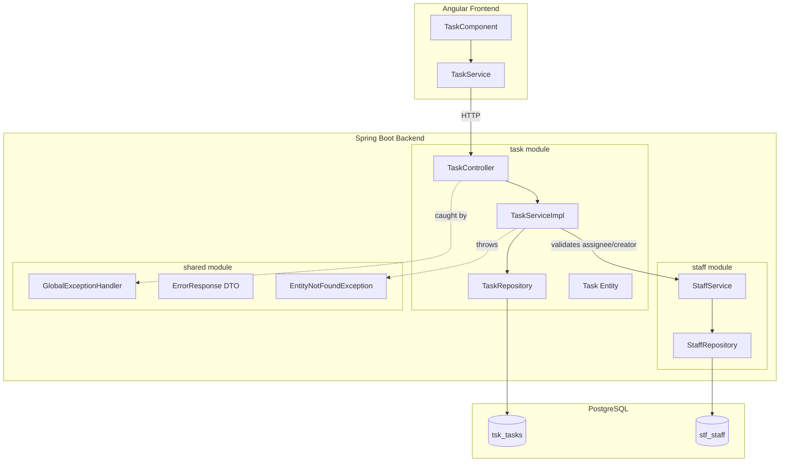
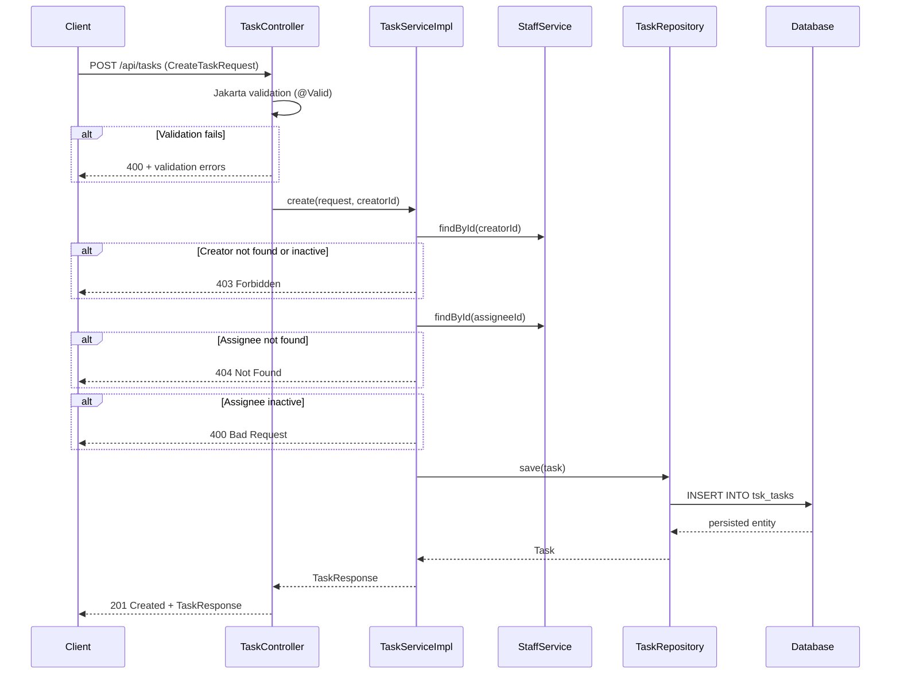
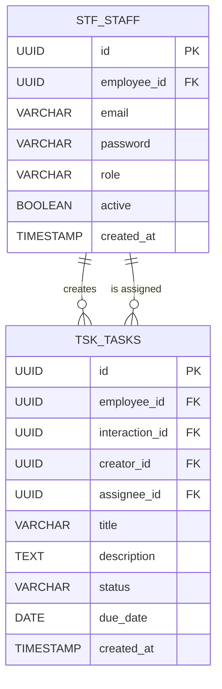

# Design Document: Staff Task Assignment

## Overview

This feature extends the existing `task` module to support staff-to-staff task assignment. Currently, tasks are linked to employees (the subjects of engagement) and optionally to interactions. This design adds `creatorId` and `assigneeId` fields to the `Task` entity, allowing staff members to assign tasks to other staff members with full lifecycle control.

The design preserves backward compatibility with existing tasks (which will have null creator/assignee fields) while layering assignment, validation, filtering, and sorting capabilities on top of the current REST API.

### Key Design Decisions

1. **Extend existing entity** rather than creating a new assignment table — keeps the domain simple and avoids unnecessary joins for the most common queries.
2. **Cross-module communication via public service interface** — the task module calls `StaffService.findById()` to validate assignee/creator existence and active status, maintaining module boundary discipline.
3. **Unified query endpoint** — rather than introducing separate endpoints for assignee/creator filters, the existing `GET /api/tasks` endpoint gains optional query parameters. This aligns with REST conventions for filterable collections.
4. **Deterministic ordering** — secondary sort by task ID ensures stable pagination even when creation timestamps collide.

## Architecture



### Request Flow for Task Creation with Assignment



## Components and Interfaces

### Backend Components

#### TaskController (modified)

- Adds `assigneeId`, `creatorId`, and `sortOrder` query parameters to `GET /api/tasks`
- Passes authenticated staff member's ID as creator to the service layer on `POST`
- Updates `PATCH /{id}/status` to accept a typed DTO instead of raw `Map<String, String>`
- Validates `sortOrder` parameter values and UUID format for filter params

#### TaskService interface (modified)

```java
public interface TaskService {
    List<TaskResponse> findAll();
    TaskResponse findById(UUID id);
    List<TaskResponse> findByEmployeeId(UUID employeeId);
    List<TaskResponse> findByAssigneeId(UUID assigneeId, String sortOrder);
    List<TaskResponse> findByCreatorId(UUID creatorId, String sortOrder);
    TaskResponse create(CreateTaskRequest request, UUID creatorId);
    TaskResponse updateStatus(UUID taskId, String status, UUID requesterId);
}
```

#### TaskServiceImpl (modified)

- Validates creator is an active staff member (calls `StaffService`)
- Validates assignee exists and is active (calls `StaffService`)
- Validates due date is not in the past
- Applies sort order with secondary sort by ID
- Enforces assignee-only status updates

#### TaskRepository (modified)

```java
public interface TaskRepository extends JpaRepository<Task, UUID> {
    List<Task> findByEmployeeId(UUID employeeId);
    List<Task> findByAssigneeIdOrderByCreatedAtDesc(UUID assigneeId);
    List<Task> findByAssigneeIdOrderByCreatedAtAsc(UUID assigneeId);
    List<Task> findByCreatorIdOrderByCreatedAtDesc(UUID creatorId);
    List<Task> findByCreatorIdOrderByCreatedAtAsc(UUID creatorId);
}
```

Alternatively, use `Sort` parameter with Spring Data for dynamic ordering:

```java
List<Task> findByAssigneeId(UUID assigneeId, Sort sort);
List<Task> findByCreatorId(UUID creatorId, Sort sort);
```

#### Task Entity (modified)

New fields: `creatorId` (UUID, nullable) and `assigneeId` (UUID, nullable).

#### CreateTaskRequest DTO (modified)

Add `@NotNull UUID assigneeId` field. The `creatorId` is not part of the request body — it comes from the authenticated principal.

#### TaskResponse DTO (modified)

Add `UUID creatorId` and `UUID assigneeId` fields.

#### UpdateStatusRequest DTO (new)

A typed record to replace the untyped `Map<String, String>`:
```java
public record UpdateStatusRequest(@NotBlank String status) {}
```

#### New Exception Classes

- `InactiveStaffException` — thrown when assigning to an inactive staff member (mapped to 400)
- `TaskAssignmentForbiddenException` — thrown when a non-assignee tries to update status (mapped to 403)
- `InvalidParameterException` — thrown for invalid query parameter values like bad UUID or invalid sortOrder (mapped to 400)

### Frontend Components

#### TaskService (modified)

- `createTask(request: CreateTaskRequest): Observable<TaskResponse>` — includes `assigneeId` in the payload
- `getTasksByAssignee(assigneeId: string, sortOrder?: string): Observable<TaskResponse[]>`
- `getTasksByCreator(creatorId: string, sortOrder?: string): Observable<TaskResponse[]>`
- `updateTaskStatus(taskId: string, status: string): Observable<TaskResponse>`

#### Task model interfaces (modified)

```typescript
export interface TaskResponse {
  id: string;
  employeeId: string;
  interactionId: string | null;
  creatorId: string | null;
  assigneeId: string | null;
  title: string;
  description: string | null;
  status: 'OPEN' | 'IN_PROGRESS' | 'COMPLETED';
  dueDate: string | null;
  createdAt: string;
}

export interface CreateTaskRequest {
  employeeId: string;
  interactionId?: string;
  assigneeId: string;
  title: string;
  description?: string;
  dueDate?: string;
}
```

## Data Models

### Task Entity Changes

| Field | Type | Constraints | Notes |
|-------|------|-------------|-------|
| `creatorId` | UUID | Nullable | FK reference to `stf_staff.id`, null for pre-existing tasks |
| `assigneeId` | UUID | Nullable | FK reference to `stf_staff.id`, null for pre-existing tasks |

### Database Migration

A Liquibase changeset adds two columns to `tsk_tasks`:

```sql
ALTER TABLE tsk_tasks ADD COLUMN creator_id UUID;
ALTER TABLE tsk_tasks ADD COLUMN assignee_id UUID;

-- Optional FK constraints (soft reference to stf_staff)
ALTER TABLE tsk_tasks ADD CONSTRAINT fk_tsk_creator
    FOREIGN KEY (creator_id) REFERENCES stf_staff(id);
ALTER TABLE tsk_tasks ADD CONSTRAINT fk_tsk_assignee
    FOREIGN KEY (assignee_id) REFERENCES stf_staff(id);

-- Index for query performance on filter endpoints
CREATE INDEX idx_tsk_tasks_assignee_id ON tsk_tasks(assignee_id);
CREATE INDEX idx_tsk_tasks_creator_id ON tsk_tasks(creator_id);
```

### TaskStatus Enum

Currently stored as a plain `String` in the entity. The design introduces a Java enum for type safety:

```java
public enum TaskStatus {
    OPEN, IN_PROGRESS, COMPLETED
}
```

The entity field changes from `String status` to `@Enumerated(EnumType.STRING) TaskStatus status`.

### Updated ERD



## Correctness Properties

*A property is a characteristic or behavior that should hold true across all valid executions of a system — essentially, a formal statement about what the system should do. Properties serve as the bridge between human-readable specifications and machine-verifiable correctness guarantees.*

### Property 1: Task creation round-trip preserves all input data

*For any* valid `CreateTaskRequest` with a valid active assignee and active creator, the `TaskResponse` returned by the create operation SHALL contain the same `employeeId`, `interactionId`, `assigneeId`, `title`, `description`, and `dueDate` as the input, plus a non-null `id`, `creatorId` matching the authenticated user, `status` equal to `OPEN`, and a non-null `createdAt`.

**Validates: Requirements 1.1, 1.2, 5.1, 5.2**

### Property 2: Invalid field values are always rejected

*For any* task creation request where the title is blank OR exceeds 255 characters OR the description exceeds 2000 characters OR the assigneeId is null, the system SHALL reject the request with HTTP 400 and the task list SHALL remain unchanged.

**Validates: Requirements 1.3, 1.6, 4.1**

### Property 3: Multi-field validation returns all errors simultaneously

*For any* task creation request that violates N field constraints simultaneously (where N >= 2), the HTTP 400 response SHALL contain at least N distinct validation error messages.

**Validates: Requirements 1.7**

### Property 4: Non-existent assignee is rejected with 404

*For any* UUID that does not correspond to an existing Staff_Member, a task creation request specifying that UUID as assigneeId SHALL be rejected with HTTP 404.

**Validates: Requirements 1.4, 4.4**

### Property 5: Inactive staff assignment is rejected

*For any* task creation request where the assignee is an inactive Staff_Member, the system SHALL reject with HTTP 400; and where the creator is not an active Staff_Member, the system SHALL reject with HTTP 403.

**Validates: Requirements 1.5, 4.3, 4.5**

### Property 6: Filter by assignee returns exactly the matching tasks

*For any* set of persisted tasks and any valid assigneeId, querying with that assigneeId SHALL return exactly the tasks whose assigneeId matches, and no others.

**Validates: Requirements 2.1**

### Property 7: Filter by creator returns exactly the matching tasks

*For any* set of persisted tasks and any valid creatorId, querying with that creatorId SHALL return exactly the tasks whose creatorId matches, and no others.

**Validates: Requirements 3.1**

### Property 8: Invalid UUID query parameters are rejected

*For any* string that is not a valid UUID format, passing it as `assigneeId` or `creatorId` query parameter SHALL result in HTTP 400 with a descriptive error message.

**Validates: Requirements 2.4, 3.4**

### Property 9: Sort ordering invariant

*For any* list of tasks returned by a query, if `sortOrder=desc` then for every consecutive pair (task_i, task_i+1), `task_i.createdAt >= task_i+1.createdAt`, and if createdAt values are equal then `task_i.id > task_i+1.id`. The inverse holds for `sortOrder=asc`.

**Validates: Requirements 7.2, 7.3, 7.6**

### Property 10: Invalid sort order is rejected

*For any* string that is not case-insensitively equal to "asc" or "desc", passing it as the `sortOrder` query parameter SHALL result in HTTP 400 with an error listing valid values and no task data in the response body.

**Validates: Requirements 7.5**

### Property 11: Invalid status value is rejected

*For any* string that is not one of "OPEN", "IN_PROGRESS", or "COMPLETED", submitting it as a status update for an existing task SHALL result in HTTP 400 with an error listing valid statuses.

**Validates: Requirements 6.2**

### Property 12: Non-assignee cannot update task status

*For any* task and any Staff_Member who is not the task's assignee, a status update request from that Staff_Member SHALL be rejected with HTTP 403.

**Validates: Requirements 6.4**

### Property 13: Past due dates are rejected

*For any* date strictly before today's date, a task creation request specifying that date as `dueDate` SHALL be rejected with HTTP 400.

**Validates: Requirements 4.2**

## Error Handling

### Exception Hierarchy

The feature introduces new exceptions within the `shared.exception` package, handled by the existing `GlobalExceptionHandler`:

| Exception | HTTP Status | When Thrown |
|-----------|-------------|-------------|
| `EntityNotFoundException` (existing) | 404 | Assignee UUID not found, Task ID not found |
| `InactiveStaffException` (new) | 400 | Assignee is inactive |
| `TaskAssignmentForbiddenException` (new) | 403 | Non-assignee attempts status update, or creator is not active |
| `InvalidParameterException` (new) | 400 | Invalid UUID format, invalid sortOrder, invalid status value, past due date |
| `MethodArgumentNotValidException` (framework) | 400 | Jakarta Bean Validation failures (blank title, null assigneeId, description too long) |

### Error Response Format

All errors use the existing `ErrorResponse` record:

```json
{
  "status": 400,
  "message": "Validation failed",
  "errors": ["title: must not be blank", "assigneeId: must not be null"],
  "timestamp": "2025-01-15T10:30:00"
}
```

### Validation Order

The system validates in this order to produce correct HTTP status codes:
1. **Jakarta Bean Validation** (controller layer) — title, description length, assigneeId not null → 400
2. **Creator validation** — creator must exist and be active → 403
3. **Assignee existence** — assignee UUID must match a staff member → 404
4. **Assignee active status** — assignee must be active → 400
5. **Business rules** — due date not in past → 400

For status updates:
1. **Task existence** — task ID must exist → 404
2. **Status value validation** — must be valid enum value → 400
3. **Assignee authorization** — requester must be the task's assignee → 403

## Testing Strategy

### Property-Based Testing

This feature's business logic (validation, filtering, sorting) is well-suited for property-based testing. The service layer contains pure logic that transforms inputs to outputs with clear rules that should hold across all valid inputs.

**Library:** [jqwik](https://jqwik.net/) — a property-based testing engine for the JVM that integrates with JUnit 5.

**Configuration:**
- Minimum 100 iterations per property test
- Each property test references its design document property via tag comment
- Tag format: `// Feature: staff-task-assignment, Property {N}: {title}`

### Unit Tests (JUnit 5 + Mockito)

Focus on specific examples and edge cases:

- **TaskServiceImpl**: Mock `TaskRepository` and `StaffService`, test each validation path with concrete examples
- Edge cases: null fields on pre-existing tasks (5.4), empty result sets (2.2, 2.5, 3.3), default sort order (7.4)
- Error message content verification

### Property Tests (jqwik)

Each correctness property maps to one property-based test:

| Property | Test Class | Generator Strategy |
|----------|-----------|-------------------|
| P1: Creation round-trip | `TaskCreationPropertyTest` | Random valid `CreateTaskRequest` with active staff members |
| P2: Invalid field rejection | `TaskValidationPropertyTest` | Random strings violating length/blank constraints |
| P3: Multi-field errors | `TaskValidationPropertyTest` | Requests with 2+ invalid fields |
| P4: Non-existent assignee | `TaskAssignmentPropertyTest` | Random UUIDs not in staff table |
| P5: Inactive staff | `TaskAssignmentPropertyTest` | Inactive staff members as assignees/creators |
| P6: Filter by assignee | `TaskQueryPropertyTest` | Random task sets with known assignee distribution |
| P7: Filter by creator | `TaskQueryPropertyTest` | Random task sets with known creator distribution |
| P8: Invalid UUID params | `TaskQueryPropertyTest` | Random non-UUID strings |
| P9: Sort ordering | `TaskSortPropertyTest` | Random task sets with varying timestamps |
| P10: Invalid sort order | `TaskSortPropertyTest` | Random strings ≠ asc/desc |
| P11: Invalid status | `TaskStatusPropertyTest` | Random strings ∉ {OPEN, IN_PROGRESS, COMPLETED} |
| P12: Non-assignee update | `TaskStatusPropertyTest` | Mismatched assignee/requester pairs |
| P13: Past due dates | `TaskValidationPropertyTest` | Random dates before today |

### Integration Tests (Testcontainers + PostgreSQL)

- Full request lifecycle: create → retrieve → filter → update status
- Database constraint verification (FK constraints, nullable columns)
- Backward compatibility: tasks without creator/assignee fields still retrievable
- Sort behavior with real DB ordering semantics

### API Tests (MockMvc)

- HTTP status code verification for all paths
- Request/response serialization (JSON field names, null handling)
- Query parameter parsing and error responses
- Content-Type and header verification

