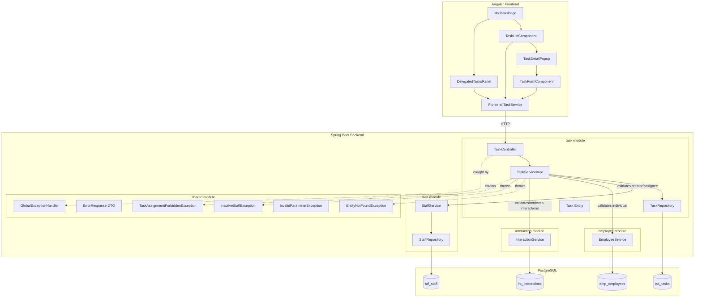
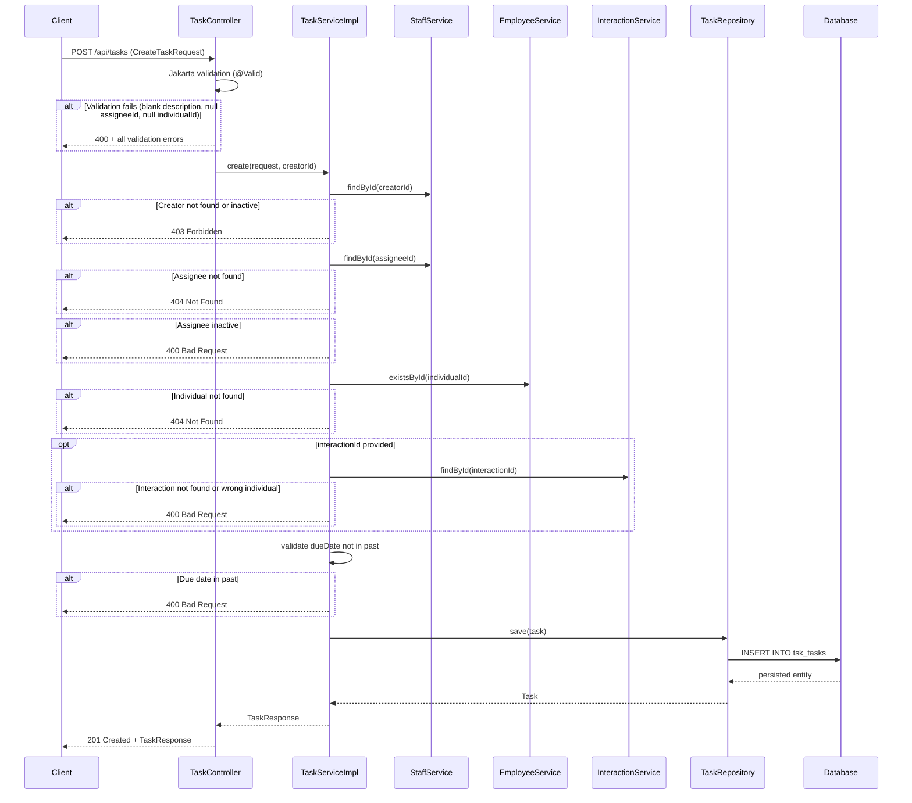
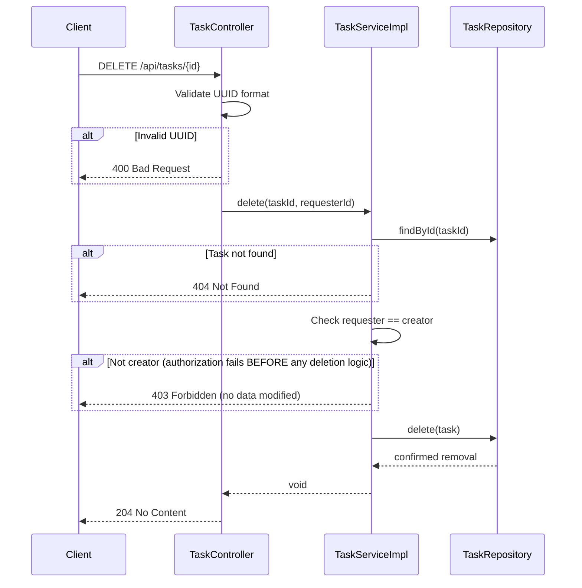
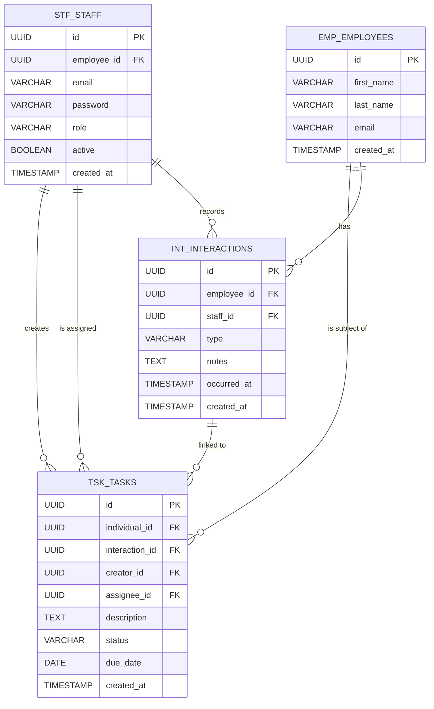

# Design Document: Staff Task Assignment

## Overview

This feature extends the existing `task` module to support staff-to-staff task assignment with full lifecycle management. Staff members can create tasks assigned to themselves or other staff, link tasks to individuals and optionally to interactions, filter/sort tasks, update status, edit, and delete tasks. A dedicated "My Tasks" page in the Angular frontend provides task list display, filtering, a creation/edit form, a detail popup, and a delegated tasks side panel.

The design modifies the `Task` entity by adding `creatorId` and `assigneeId` fields and replacing the existing `title`-centric model with a `description`-centric model aligned to the requirements. The `individualId` field replaces the semantics of `employeeId` (the subject individual the task relates to). Status values change from `OPEN`/`IN_PROGRESS`/`COMPLETED` to `TODO`/`IN_PROGRESS`/`DONE`.

### Key Design Decisions

1. **Extend existing entity** — adds `creatorId` and `assigneeId` columns to `tsk_tasks` rather than introducing a separate assignment table. Keeps the domain simple.
2. **Cross-module communication via public service interface** — task module calls `StaffService.findById()` and `InteractionService.findByEmployeeId()` to validate staff/interaction data without reaching into other module internals.
3. **Unified query endpoint** — `GET /api/tasks` gains optional filter/sort query parameters rather than separate endpoints per filter combination. Consistent with REST collection patterns.
4. **Deterministic ordering** — secondary sort by task ID ensures stable pagination when primary sort values collide.
5. **UUID validation is unconditional** — invalid UUID format on path/query params always returns HTTP 400 regardless of any system validation configuration settings.
6. **Individual existence returns 404 on interactions endpoint** — `/api/tasks/interactions` returns 404 for non-existent individuals, not an empty list.
7. **Strict delete authorization** — authorization checks execute before any deletion logic; no data modification occurs on unauthorized attempts.
8. **Description-centric model** — tasks use `description` as the primary required text field (not `title`). The `title` field is removed from the new task flow.

## Architecture



### Request Flow: Task Creation



### Request Flow: Delete Task (Strict Authorization)



## Components and Interfaces

### Backend Components

#### TaskController (modified)

```java
@RestController
@RequestMapping("/api/tasks")
public class TaskController {

    // GET /api/tasks - with filter/sort query params
    // Query params: assigneeId, creatorId, excludeSelfAssigned, status,
    //               dueDateFrom, dueDateTo, createdFrom, createdTo,
    //               sortBy, sortOrder, page, size
    @GetMapping
    List<TaskResponse> findTasks(
        @RequestParam(required = false) String assigneeId,
        @RequestParam(required = false) String creatorId,
        @RequestParam(required = false) Boolean excludeSelfAssigned,
        @RequestParam(required = false) String status,
        @RequestParam(required = false) String dueDateFrom,
        @RequestParam(required = false) String dueDateTo,
        @RequestParam(required = false) String createdFrom,
        @RequestParam(required = false) String createdTo,
        @RequestParam(defaultValue = "createdDate") String sortBy,
        @RequestParam(defaultValue = "desc") String sortOrder,
        @RequestParam(defaultValue = "0") int page,
        @RequestParam(defaultValue = "50") int size
    );

    // GET /api/tasks/{id}
    @GetMapping("/{id}")
    TaskResponse findById(@PathVariable UUID id);

    // POST /api/tasks
    @PostMapping
    @ResponseStatus(HttpStatus.CREATED)
    TaskResponse create(@Valid @RequestBody CreateTaskRequest request);

    // PUT /api/tasks/{id}
    @PutMapping("/{id}")
    TaskResponse update(@PathVariable UUID id, @Valid @RequestBody UpdateTaskRequest request);

    // PATCH /api/tasks/{id}/status
    @PatchMapping("/{id}/status")
    TaskResponse updateStatus(@PathVariable UUID id, @Valid @RequestBody UpdateStatusRequest request);

    // DELETE /api/tasks/{id}
    @DeleteMapping("/{id}")
    @ResponseStatus(HttpStatus.NO_CONTENT)
    void delete(@PathVariable UUID id);

    // GET /api/tasks/interactions?individualId={uuid}
    @GetMapping("/interactions")
    List<InteractionResponse> getInteractionsForIndividual(@RequestParam String individualId);
}
```

Key behaviors:
- UUID format validation on `assigneeId`, `creatorId`, `individualId` query params always returns HTTP 400 regardless of system validation configuration
- `/api/tasks/interactions` returns HTTP 404 for non-existent individuals (not empty list)
- UUID format validation on path variables (`{id}`) returns HTTP 400 for invalid format
- All filter params validated before reaching service layer

#### TaskService interface (modified)

```java
public interface TaskService {
    TaskResponse findById(UUID id);
    TaskQueryResult findTasks(TaskQueryParams params);
    TaskResponse create(CreateTaskRequest request, UUID creatorId);
    TaskResponse update(UUID taskId, UpdateTaskRequest request, UUID requesterId);
    TaskResponse updateStatus(UUID taskId, UpdateStatusRequest request, UUID requesterId);
    void delete(UUID taskId, UUID requesterId);
    List<InteractionResponse> getInteractionsForIndividual(UUID individualId);
}
```

#### TaskServiceImpl (modified)

Validation and behavior rules:
- **Creator validation**: Checks creator exists and is active; rejects with 403 if not (only checks active membership — no per-individual/department permission checks)
- **Assignee existence first**: Validates assignee exists before checking active status; 404 if not found, 400 if inactive
- **Individual validation**: Validates individual ID corresponds to existing employee/staff; 404 if not found
- **Interaction validation on create**: When interactionId provided, validates interaction exists AND belongs to specified individual; 400 if not
- **Interaction validation on edit**: Only validates when interactionId is provided in the edit request; skips entirely when field is omitted
- **Due date validation**: Rejects dates strictly before current server-local date with 400
- **InteractionId in response**: Validates that non-null interactionId values correspond to actual linked interactions before including in response; returns null if the linked interaction no longer exists
- **Delete authorization**: Strict checks before any deletion logic — no data modification occurs on unauthorized attempts
- **Assignee edit validation**: Explicitly validates new assignee exists and is active on edit, even when the new assignee appears valid
- **Null due dates sorted last**: When sorting by dueDate, tasks with null due dates appear last regardless of sort direction
- **Delegated tasks filter**: When `creatorId` and `excludeSelfAssigned=true` are combined, returns only tasks where creator = specified user AND assignee ≠ creator (both constraints enforced together)

#### TaskRepository (modified)

```java
public interface TaskRepository extends JpaRepository<Task, UUID>, JpaSpecificationExecutor<Task> {
    List<Task> findByEmployeeId(UUID employeeId);
}
```

Uses `JpaSpecificationExecutor` with dynamic `Specification<Task>` objects for flexible query composition across all filter/sort combinations.

#### DTOs

**CreateTaskRequest** (modified):
```java
public record CreateTaskRequest(
    @NotNull(message = "Individual ID is required")
    UUID individualId,
    
    UUID interactionId,  // optional
    
    @NotNull(message = "Assignee ID is required")
    UUID assigneeId,
    
    @NotBlank(message = "Description must not be blank")
    @Size(max = 2000, message = "Description must not exceed 2000 characters")
    String description,
    
    LocalDate dueDate  // optional, validated in service layer
) {}
```

**UpdateTaskRequest** (new):
```java
public record UpdateTaskRequest(
    @NotNull(message = "Individual ID is required")
    UUID individualId,
    
    UUID interactionId,  // optional; when omitted, skip interaction validation
    
    @NotNull(message = "Assignee ID is required")
    UUID assigneeId,
    
    @NotBlank(message = "Description must not be blank")
    @Size(max = 2000, message = "Description must not exceed 2000 characters")
    String description,
    
    LocalDate dueDate  // optional
) {}
```

**UpdateStatusRequest** (typed record):
```java
public record UpdateStatusRequest(
    @NotBlank(message = "Status is required")
    String status
) {}
```

**TaskResponse** (modified):
```java
public record TaskResponse(
    UUID id,
    UUID individualId,
    UUID interactionId,   // nullable
    UUID creatorId,
    UUID assigneeId,
    String description,
    String status,
    LocalDate dueDate,    // nullable
    LocalDateTime createdAt
) {}
```

**TaskQueryParams** (new):
```java
public record TaskQueryParams(
    UUID assigneeId,
    UUID creatorId,
    Boolean excludeSelfAssigned,
    TaskStatus status,
    LocalDate dueDateFrom,
    LocalDate dueDateTo,
    LocalDate createdFrom,
    LocalDate createdTo,
    String sortBy,       // "dueDate" or "createdDate"
    String sortOrder,    // "asc" or "desc"
    int page,
    int size
) {}
```

**TaskQueryResult** (new):
```java
public record TaskQueryResult(
    List<TaskResponse> tasks,
    long totalCount,
    int currentPage,
    int pageSize
) {}
```

**InteractionResponse** (for `/api/tasks/interactions`):
```java
public record InteractionResponse(
    UUID id,
    UUID employeeId,
    UUID staffId,
    String type,
    String notes,
    LocalDateTime occurredAt,
    LocalDateTime createdAt
) {}
```

#### Task Entity (modified)

```java
@Entity
@Table(name = "tsk_tasks")
public class Task {

    @Id
    @GeneratedValue(strategy = GenerationType.UUID)
    private UUID id;

    @Column(name = "individual_id", nullable = false)
    private UUID individualId;

    @Column(name = "interaction_id")
    private UUID interactionId;

    @Column(name = "creator_id", nullable = false)
    private UUID creatorId;

    @Column(name = "assignee_id", nullable = false)
    private UUID assigneeId;

    @Column(nullable = false, columnDefinition = "TEXT")
    private String description;

    @Enumerated(EnumType.STRING)
    @Column(nullable = false)
    private TaskStatus status;

    @Column(name = "due_date")
    private LocalDate dueDate;

    @Column(name = "created_at", nullable = false, updatable = false)
    private LocalDateTime createdAt;

    // constructors, getters, setters
}
```

#### TaskStatus Enum (updated)

```java
public enum TaskStatus {
    TODO, IN_PROGRESS, DONE
}
```

#### New Exception Classes

| Exception | HTTP Status | When Thrown |
|-----------|-------------|-------------|
| `EntityNotFoundException` (existing) | 404 | Assignee not found, Task ID not found, Individual not found |
| `InactiveStaffException` (existing) | 400 | Assignee is inactive |
| `TaskAssignmentForbiddenException` (existing) | 403 | Non-assignee status update, non-creator edit/delete, inactive creator |
| `InvalidParameterException` (existing) | 400 | Invalid UUID format, invalid sortOrder/sortBy/status param, past due date, invalid date format |

### Frontend Components

#### TaskService (modified)

```typescript
@Injectable({ providedIn: 'root' })
export class TaskService {
  private readonly baseUrl = `${environment.apiUrl}/tasks`;

  createTask(request: CreateTaskRequest): Observable<TaskResponse>;
  updateTask(id: string, request: UpdateTaskRequest): Observable<TaskResponse>;
  deleteTask(id: string): Observable<void>;
  getTasks(params: TaskQueryParams): Observable<TaskQueryResult>;
  getTaskById(id: string): Observable<TaskResponse>;
  updateTaskStatus(taskId: string, status: string): Observable<TaskResponse>;
  getInteractionsForIndividual(individualId: string): Observable<InteractionSummary[]>;
}
```

#### TypeScript Interfaces (updated)

```typescript
export type TaskStatus = 'TODO' | 'IN_PROGRESS' | 'DONE';

export interface TaskResponse {
  id: string;
  individualId: string;
  interactionId: string | null;
  creatorId: string;
  assigneeId: string;
  description: string;
  status: TaskStatus;
  dueDate: string | null;
  createdAt: string;
}

export interface CreateTaskRequest {
  individualId: string;
  interactionId?: string;
  assigneeId: string;
  description: string;
  dueDate?: string;
}

export interface UpdateTaskRequest {
  individualId: string;
  interactionId?: string;
  assigneeId: string;
  description: string;
  dueDate?: string | null;
}

export interface TaskQueryParams {
  assigneeId?: string;
  creatorId?: string;
  excludeSelfAssigned?: boolean;
  status?: TaskStatus;
  dueDateFrom?: string;
  dueDateTo?: string;
  createdFrom?: string;
  createdTo?: string;
  sortBy?: 'dueDate' | 'createdDate';
  sortOrder?: 'asc' | 'desc';
  page?: number;
  size?: number;
}

export interface TaskQueryResult {
  tasks: TaskResponse[];
  totalCount: number;
  currentPage: number;
  pageSize: number;
}

export interface InteractionSummary {
  id: string;
  employeeId: string;
  staffId: string;
  type: string;
  notes: string;
  occurredAt: string;
  createdAt: string;
}
```

#### MyTasksPage Component (new)

- Route: `/tasks` (child of authenticated layout, lazy-loaded)
- Contains `TaskListComponent` and `DelegatedTasksPanel` side-by-side
- Provides button/action to open `TaskFormComponent` for creation

#### TaskListComponent (new)

- Fetches tasks assigned to current user on load (ordered by createdDate desc)
- Displays filter controls: status dropdown, due date range pickers, created date range pickers
- Shows loading indicator **only during task list fetching** (not during other backend operations like auth or filter validation)
- Displays each task: description (truncated to 100 chars + ellipsis), status, due date, individual name
- On empty results: shows "no tasks match selected filters" message
- On fetch error: displays error message AND retry action together (never error without retry)
- Clicking a task opens `TaskDetailPopup`

#### TaskFormComponent (new)

- Used for both creation and editing (pre-populates fields on edit)
- Fields: Description (required, max 2000 chars, shows remaining count), Assignee dropdown (defaults to current user), Individual search/selector, Due Date picker (prevents past dates), Link Interaction toggle + interaction dropdown
- **Blocks submission immediately** when required fields (description, individual, assignee) are empty — prevents request from reaching backend
- Description field must **contain text** to be considered filled (whitespace-only is not valid)
- On successful submit: shows confirmation, closes form, triggers list refresh
- On backend validation errors (400): displays inline errors next to fields
- On server error (5xx): shows error, preserves all entered form data for retry

#### TaskDetailPopup (new)

- Shows full task details: description, status, assignee name, creator name, individual name, due date (or "No due date"), linked interaction (or "No linked interaction")
- Linked interaction rendered as clickable link (date + type) navigating to interaction detail
- If current user is creator: shows Edit and Delete actions
- If current user is NOT creator: hides Edit and Delete actions
- Delete action: confirmation dialog → backend DELETE → refresh list on 204
- Close control dismisses popup, returns focus to task list

#### DelegatedTasksPanel (new)

- Fetches tasks where creator = current user AND assignee ≠ current user (both constraints enforced together)
- Uses `creatorId` + `excludeSelfAssigned=true` query params
- Shows up to 50 most recent, ordered by createdDate desc
- Displays: description (truncated 100 chars), assignee name, status
- Refreshes on task creation, edit, or deletion
- On empty: shows "no delegated tasks" message
- On error: shows error AND retry action together

#### LayoutComponent (modified)

- Adds "My Tasks" navigation link visible to all authenticated staff
- Applies active CSS class when route matches `/tasks`

## Data Models

### Task Entity Changes

| Field | Type | Constraints | Notes |
|-------|------|-------------|-------|
| `id` | UUID | PK, auto-generated | |
| `individual_id` | UUID | NOT NULL | Replaces `employee_id`; FK to employee/staff |
| `interaction_id` | UUID | Nullable | FK to interaction; validated on write |
| `creator_id` | UUID | NOT NULL | FK to `stf_staff.id` |
| `assignee_id` | UUID | NOT NULL | FK to `stf_staff.id` |
| `description` | TEXT | NOT NULL | Max 2000 chars (app-level) |
| `status` | VARCHAR | NOT NULL | Enum: TODO, IN_PROGRESS, DONE |
| `due_date` | DATE | Nullable | Must be today or future on write |
| `created_at` | TIMESTAMP | NOT NULL, immutable | Set on creation |

### Database Migration

Liquibase changeset to evolve `tsk_tasks`:

```sql
-- Rename employee_id to individual_id
ALTER TABLE tsk_tasks RENAME COLUMN employee_id TO individual_id;

-- Add creator and assignee columns
ALTER TABLE tsk_tasks ADD COLUMN creator_id UUID;
ALTER TABLE tsk_tasks ADD COLUMN assignee_id UUID;

-- Drop title column (replaced by description as primary field)
ALTER TABLE tsk_tasks DROP COLUMN title;

-- Make description NOT NULL (backfill existing nulls first)
UPDATE tsk_tasks SET description = '' WHERE description IS NULL;
ALTER TABLE tsk_tasks ALTER COLUMN description SET NOT NULL;

-- Update status values: OPEN -> TODO, COMPLETED -> DONE
UPDATE tsk_tasks SET status = 'TODO' WHERE status = 'OPEN';
UPDATE tsk_tasks SET status = 'DONE' WHERE status = 'COMPLETED';

-- FK constraints
ALTER TABLE tsk_tasks ADD CONSTRAINT fk_tsk_creator
    FOREIGN KEY (creator_id) REFERENCES stf_staff(id);
ALTER TABLE tsk_tasks ADD CONSTRAINT fk_tsk_assignee
    FOREIGN KEY (assignee_id) REFERENCES stf_staff(id);

-- Indexes for query performance
CREATE INDEX idx_tsk_tasks_assignee_id ON tsk_tasks(assignee_id);
CREATE INDEX idx_tsk_tasks_creator_id ON tsk_tasks(creator_id);
CREATE INDEX idx_tsk_tasks_individual_id ON tsk_tasks(individual_id);
CREATE INDEX idx_tsk_tasks_status ON tsk_tasks(status);
CREATE INDEX idx_tsk_tasks_due_date ON tsk_tasks(due_date);
CREATE INDEX idx_tsk_tasks_created_at ON tsk_tasks(created_at);
```

### Updated ERD




## Correctness Properties

*A property is a characteristic or behavior that should hold true across all valid executions of a system — essentially, a formal statement about what the system should do. Properties serve as the bridge between human-readable specifications and machine-verifiable correctness guarantees.*

### Property 1: Task creation round-trip preserves all input data

*For any* valid `CreateTaskRequest` with a non-blank description (≤2000 chars), an active assignee, an existing individual, a valid optional interaction belonging to that individual, and a due date that is today or in the future (or null), the `TaskResponse` returned SHALL contain the same `individualId`, `interactionId`, `assigneeId`, and `description` as the input, plus a non-null `id`, `creatorId` matching the authenticated user, `status` equal to `TODO`, matching `dueDate`, and a non-null `createdAt`.

**Validates: Requirements 1.1, 1.2, 1.9, 5.1, 5.2, 5.5**

### Property 2: Description validation rejects blank and oversized inputs

*For any* string that is blank (null, empty, or composed entirely of whitespace) OR exceeds 2000 characters, a task creation or edit request with that string as description SHALL be rejected with HTTP 400 and the task data SHALL remain unchanged.

**Validates: Requirements 1.3, 4.1, 8.7, 13.3**

### Property 3: Multi-field validation returns all errors simultaneously

*For any* task creation request that violates N field constraints simultaneously (where N ≥ 2, e.g., blank description + null assigneeId + null individualId), the HTTP 400 response SHALL contain at least N distinct validation error messages in a single response.

**Validates: Requirements 1.8, 4.1**

### Property 4: Non-existent assignee is rejected with 404; inactive assignee with 400

*For any* UUID that does not correspond to an existing Staff_Member, a task creation or edit request specifying that UUID as assigneeId SHALL be rejected with HTTP 404. *For any* inactive Staff_Member used as assigneeId, the request SHALL be rejected with HTTP 400.

**Validates: Requirements 1.4, 1.5, 4.4, 4.5, 8.4**

### Property 5: Inactive creator is rejected with 403

*For any* Staff_Member who is not active, attempting to create a task SHALL be rejected with HTTP 403. Only active membership is checked — no per-individual/department permission validation is required.

**Validates: Requirements 4.3**

### Property 6: Invalid UUID format always returns HTTP 400

*For any* string that is not a valid UUID format, passing it as `assigneeId`, `creatorId`, or `individualId` query parameter, or as a task ID path variable, SHALL always result in HTTP 400 regardless of any system validation configuration settings.

**Validates: Requirements 2.4, 3.4, 9.4, 10.4**

### Property 7: Valid UUID but non-existent staff returns empty list with 200

*For any* valid-format UUID that does not correspond to an existing Staff_Member, querying with that UUID as `assigneeId` or `creatorId` SHALL return an empty list with HTTP 200. If an invalid UUID bypasses format validation and reaches the Task_Service, it SHALL be treated as non-existent and return an empty list with HTTP 200.

**Validates: Requirements 2.5, 3.6**

### Property 8: Filter by assignee returns exactly matching tasks

*For any* set of persisted tasks and any valid assigneeId, querying with that assigneeId SHALL return exactly the tasks whose assigneeId matches — no more, no less — ordered by the specified sort criteria.

**Validates: Requirements 2.1, 2.2**

### Property 9: Filter by creator with excludeSelfAssigned enforces both constraints

*For any* set of persisted tasks, when querying with a `creatorId` and `excludeSelfAssigned=true`, the result SHALL contain only tasks where the creator matches the specified ID AND the assignee differs from the creator. Both constraints must be satisfied simultaneously.

**Validates: Requirements 3.1, 3.5, 14.2**

### Property 10: Sort ordering invariant

*For any* list of tasks returned by a query, if `sortBy=createdDate` and `sortOrder=desc` then for every consecutive pair (task_i, task_i+1), `task_i.createdAt >= task_i+1.createdAt`; if equal, `task_i.id > task_i+1.id`. The inverse holds for `asc`. When `sortBy=dueDate`, tasks with null due dates SHALL appear last regardless of sort direction.

**Validates: Requirements 7.4, 7.5, 7.9**

### Property 11: Filter combination applies all constraints as AND

*For any* combination of filter parameters (status, dueDateFrom, dueDateTo, createdFrom, createdTo, assigneeId, creatorId), all filters SHALL be applied together as an AND combination. Every task in the result set SHALL satisfy all provided filter criteria. Date range filters are inclusive on both bounds. Partial date ranges (only from or only to) filter with an open-ended bound.

**Validates: Requirements 7.1, 7.2, 7.3, 7.7, 7.8**

### Property 12: Invalid filter parameter values are rejected with 400

*For any* string not case-insensitively equal to a valid `status` value (TODO, IN_PROGRESS, DONE), or not equal to a valid `sortBy` value (dueDate, createdDate), or not equal to a valid `sortOrder` value (asc, desc), or not in valid ISO 8601 date format (yyyy-MM-dd) for date parameters, the system SHALL reject with HTTP 400 listing valid values.

**Validates: Requirements 7.6, 7.10**

### Property 13: Past due dates are rejected

*For any* date strictly before today's server-local date, a task creation or edit request specifying that date as `dueDate` SHALL be rejected with HTTP 400.

**Validates: Requirements 4.2**

### Property 14: Status update validation order and authorization

*For any* status update request, the system SHALL evaluate in order: task existence (404) → assignee authorization (403) → status value validity (400), returning the first failure. *For any* task and any Staff_Member who is not the task's assignee, a status update SHALL be rejected with HTTP 403. *For any* string not in {TODO, IN_PROGRESS, DONE}, status update SHALL be rejected with HTTP 400.

**Validates: Requirements 6.2, 6.3, 6.4, 6.5**

### Property 15: Any valid status can transition to any other valid status

*For any* task with any current status and any target status in {TODO, IN_PROGRESS, DONE} (including same-to-same), a status update by the assignee SHALL succeed with HTTP 200.

**Validates: Requirements 6.1, 6.6**

### Property 16: Edit authorization and round-trip

*For any* task and its creator, an edit request with valid data SHALL update the task and return the updated representation with HTTP 200. *For any* task and a requester who is not the creator, the edit SHALL be rejected with HTTP 403. *For any* non-existent task ID, the edit SHALL be rejected with HTTP 404.

**Validates: Requirements 8.1, 8.2, 8.3**

### Property 17: Interaction validation conditional on field presence

*For any* edit request that includes an interactionId, the system SHALL validate that the interaction exists and belongs to the specified individual (rejecting with 400 if not). *For any* edit request that omits the interactionId field, the system SHALL skip interaction validation entirely and process the request normally.

**Validates: Requirements 8.5**

### Property 18: Delete authorization is strict — no data modification on unauthorized attempts

*For any* task and its creator, deletion SHALL succeed with HTTP 204 and the task SHALL no longer exist in the database. *For any* task and a non-creator requester, deletion SHALL be rejected with HTTP 403 and the task SHALL remain completely unchanged in the database. Authorization checks execute before any deletion logic. *For any* non-existent task ID, deletion SHALL return HTTP 404 regardless of requester identity.

**Validates: Requirements 9.1, 9.2, 9.3**

### Property 19: Interactions endpoint returns 404 for non-existent individuals

*For any* valid UUID that does not correspond to an existing employee or staff member, the GET `/api/tasks/interactions` endpoint SHALL return HTTP 404 (not an empty list). *For any* existing individual, the endpoint SHALL return up to 50 interactions ordered by `occurredAt` descending, each containing all required fields.

**Validates: Requirements 10.1, 10.2, 10.3**

### Property 20: Non-null interactionId values validated before inclusion in response

*For any* task response, if the `interactionId` field is non-null, the service SHALL have validated that this ID corresponds to an actual linked interaction. If a previously-linked interaction no longer exists, the response SHALL return null for `interactionId`.

**Validates: Requirements 5.4**

### Property 21: Pagination enforced at 50 tasks per page

*For any* query result exceeding 50 tasks, the response SHALL contain at most 50 tasks per page and SHALL include total count and current page metadata.

**Validates: Requirements 2.6**

### Property 22: Form blocks submission when required fields are empty

*For any* state of the Task_Form_Component where description is empty/whitespace-only OR individual is not selected OR assignee is not selected, the form SHALL immediately block submission and prevent any request from reaching the backend.

**Validates: Requirements 13.9**

## Error Handling

### Exception Hierarchy

| Exception | HTTP Status | When Thrown |
|-----------|-------------|-------------|
| `EntityNotFoundException` (existing) | 404 | Assignee not found, Task ID not found, Individual not found |
| `InactiveStaffException` (existing) | 400 | Assignee is inactive |
| `TaskAssignmentForbiddenException` (existing) | 403 | Non-assignee status update, non-creator edit/delete, inactive creator |
| `InvalidParameterException` (existing) | 400 | Invalid UUID format, invalid sortOrder/sortBy/status, past due date, invalid date format, interaction doesn't belong to individual |
| `MethodArgumentNotValidException` (framework) | 400 | Jakarta Bean Validation failures (blank description, null assigneeId, null individualId, description too long) |

### Error Response Format

All errors use the existing `ErrorResponse` record:

```json
{
  "status": 400,
  "message": "Validation failed",
  "errors": ["description: must not be blank", "assigneeId: must not be null"],
  "timestamp": "2025-01-15T10:30:00"
}
```

### Validation Order

**Task Creation:**
1. **Jakarta Bean Validation** (controller layer) — description not blank + ≤2000 chars, assigneeId not null, individualId not null → 400 (all errors returned together)
2. **Creator validation** — creator must exist and be active → 403
3. **Assignee existence** — checked first before any other assignee properties → 404
4. **Assignee active status** — must be active → 400
5. **Individual existence** — must correspond to existing employee/staff → 404
6. **Interaction validation** — when interactionId provided, must exist and belong to individual → 400
7. **Due date validation** — must not be in the past → 400

**Task Edit:**
1. **Jakarta Bean Validation** — same as creation → 400
2. **Task existence** — task ID must exist → 404
3. **Creator authorization** — requester must be the task's creator → 403
4. **Assignee validation** — new assignee must exist and be active (always validated, even when appears valid) → 404/400
5. **Individual existence** — must exist → 400
6. **Interaction validation** — only when interactionId is provided; skipped when omitted → 400
7. **Due date validation** — must not be in the past → 400

**Status Update** (applied to all requests regardless of requester):
1. **Task existence** → 404
2. **Assignee authorization** — requester must be the task's assignee → 403
3. **Status value validation** — must be valid enum value → 400

**Task Delete:**
1. **UUID format validation** — task ID must be valid UUID → 400
2. **Task existence** → 404
3. **Creator authorization** — strict checks before any deletion logic; no data modification occurs → 403

**UUID Format Validation (query/path params):**
- Invalid UUID format → always HTTP 400 regardless of system validation configuration
- If invalid UUID somehow reaches Task_Service → treated as non-existent (empty list with 200)

**Interaction Retrieval (`/api/tasks/interactions`):**
- Missing or invalid UUID format for `individualId` → HTTP 400
- Valid UUID but individual doesn't exist → HTTP 404 (not empty list)

## Testing Strategy

### Property-Based Testing

This feature's backend business logic (validation, filtering, sorting, authorization) is well-suited for property-based testing. The service layer contains deterministic logic that transforms inputs to outputs with clear rules that should hold across all valid inputs.

**Library:** [jqwik](https://jqwik.net/) — a property-based testing engine for the JVM that integrates with JUnit 5.

**Configuration:**
- Minimum 100 iterations per property test
- Each property test references its design document property via tag comment
- Tag format: `// Feature: staff-task-assignment, Property {N}: {title}`

### Unit Tests (JUnit 5 + Mockito)

Focus on specific examples and edge cases:

- **TaskServiceImpl**: Mock `TaskRepository`, `StaffService`, `EmployeeService`, `InteractionService`
- Specific examples: null dueDate creation succeeds, empty result sets, default sort order
- Error message content verification
- Validation order verification with concrete scenarios
- Interaction validation skipped on edit when interactionId omitted

### Property Tests (jqwik)

Each correctness property maps to one or more property-based tests:

| Property | Test Class | Generator Strategy |
|----------|-----------|-------------------|
| P1: Creation round-trip | `TaskCreationPropertyTest` | Random valid requests with active staff, existing individuals, valid interactions |
| P2: Description validation | `TaskValidationPropertyTest` | Random blank/whitespace strings and strings > 2000 chars |
| P3: Multi-field errors | `TaskValidationPropertyTest` | Requests with 2+ invalid fields |
| P4: Assignee validation | `TaskAssignmentPropertyTest` | Random non-existent UUIDs + inactive staff members |
| P5: Inactive creator | `TaskAssignmentPropertyTest` | Inactive staff as creators |
| P6: Invalid UUID format | `TaskParameterPropertyTest` | Random non-UUID strings |
| P7: Non-existent UUID → empty list | `TaskQueryPropertyTest` | Valid UUIDs not in staff table |
| P8: Filter by assignee | `TaskQueryPropertyTest` | Random task sets with known assignee distribution |
| P9: Delegated filter (both constraints) | `TaskQueryPropertyTest` | Tasks with varied creator/assignee combos |
| P10: Sort ordering | `TaskSortPropertyTest` | Random task sets with varying timestamps and null dueDates |
| P11: Filter combination (AND) | `TaskQueryPropertyTest` | Random filter param combinations |
| P12: Invalid filter params | `TaskParameterPropertyTest` | Random invalid status/sortBy/sortOrder/date strings |
| P13: Past due dates | `TaskValidationPropertyTest` | Random dates before today |
| P14: Status update validation order | `TaskStatusPropertyTest` | Requests failing at different validation stages |
| P15: Status transitions | `TaskStatusPropertyTest` | All status pairs including same-to-same |
| P16: Edit auth + round-trip | `TaskEditPropertyTest` | Creator vs non-creator edits |
| P17: Interaction validation conditional | `TaskEditPropertyTest` | Edits with/without interactionId field |
| P18: Delete authorization strict | `TaskDeletePropertyTest` | Creator vs non-creator deletes, verify task unchanged |
| P19: Interactions endpoint 404 | `TaskInteractionPropertyTest` | Non-existent individual UUIDs |
| P20: InteractionId validation in response | `TaskResponsePropertyTest` | Tasks with valid/invalid/null interaction links |
| P21: Pagination | `TaskQueryPropertyTest` | Task sets > 50 |
| P22: Form submission blocking | `TaskFormPropertyTest` (frontend) | Combinations of empty/whitespace required fields |

### Integration Tests (Testcontainers + PostgreSQL)

- Full request lifecycle: create → retrieve → filter → update status → edit → delete
- Database constraint verification (FK constraints, NOT NULL columns)
- Pagination with real datasets exceeding 50 tasks
- Sort behavior with real DB ordering (null dueDate positioning)
- UUID format rejection at controller level
- `/api/tasks/interactions` returns 404 for non-existent individual (not empty list)
- Delete authorization: verify task persists unchanged after 403

### API Tests (MockMvc)

- HTTP status code verification for all error paths
- Request/response serialization (JSON field names, null handling)
- Query parameter parsing (UUID format validation always returns 400)
- Multi-field validation error response structure
- Content-Type and header verification
- Validation order: correct HTTP status codes based on which check fails first

### Frontend Tests (Jasmine + Angular TestBed)

- TaskListComponent: loading indicator only during task list fetch, not other operations
- TaskFormComponent: immediate submission blocking when required fields empty
- TaskFormComponent: description must contain text (whitespace-only blocked)
- DelegatedTasksPanel: verifies backend call uses both creator AND excludeSelfAssigned constraints
- Error + retry displayed together (never error without retry)
- TaskDetailPopup: Edit/Delete hidden for non-creators
